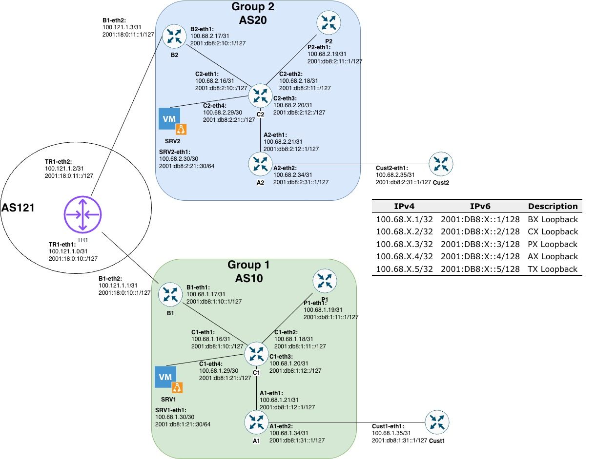

**Language / Ngôn ngữ:** [English](README.md) | [Tiếng Việt](README_vi.md)

# APRICOT 2026 PCIO Network Configuration - Step-by-Step Guide

## Lab Overview

In this lab, you will configure a network with two autonomous systems (groups) that connect through a transit provider. Each group has its own internal routing protocol and peers with the transit provider using eBGP.

### Network Architecture

```
Group 1 (AS10)  <---> Transit Provider (AS121) <---> Group 2 (AS20)
  OSPF IGP          eBGP Peering              IS-IS IGP
```



### Router Roles

**Group 1 (AS10) - OSPF IGP:**

- **Router-C1**: Core router (Route Reflector)
- **Router-B1**: Border router (connects to Transit Provider)
- **Router-A1**: Access router
- **Router-P1**: Peering router
- **Router-Cust1**: Customer router (AS65001)

**Group 2 (AS20) - IS-IS IGP:**

- **Router-C2**: Core router (Route Reflector)
- **Router-B2**: Border router (connects to Transit Provider)
- **Router-A2**: Access router
- **Router-P2**: Peering router
- **Router-Cust2**: Customer router (AS65002)

**Transit Provider (AS121):**

- **Router-TR1**: Transit router (connects both groups)

### Group 1 (AS10) - OSPF IGP

#### Router-C1 (Core / Route Reflector)

| Interface | IPv4 Address | IPv6 Address | Mục Đích |
|-----------|--------------|--------------|---------|
| lo | 100.68.1.2/32 | 2001:db8:1:2::1/128 | Loopback (Router ID) |
| eth1 | 100.68.1.16/31 | 2001:db8:1:16::1/64 | Link to C1-B1 |
| eth2 | 100.68.1.18/31 | 2001:db8:1:18::1/64 | Link to C1-A1 |
| eth3 | 100.68.1.20/31 | 2001:db8:1:20::1/64 | Link to C1-P1 |

#### Router-B1 (Border Router)

| Interface | IPv4 Address | IPv6 Address | Mục Đích |
|-----------|--------------|--------------|---------|
| lo | 100.68.1.1/32 | 2001:db8:1:1::1/128 | Loopback (Router ID) |
| eth1 | 100.68.1.17/31 | 2001:db8:1:17::1/64 | Link to B1-C1 |
| eth2 | 100.121.1.1/31 | 2001:db8:121:1::1/64 | eBGP to Transit (TR1) |

#### Router-A1 (Access Router)

| Interface | IPv4 Address | IPv6 Address | Mục Đích |
|-----------|--------------|--------------|---------|
| lo | 100.68.1.4/32 | 2001:db8:1:4::1/128 | Loopback (Router ID) |
| eth1 | 100.68.1.19/31 | 2001:db8:1:19::1/64 | Link to A1-C1 |

#### Router-P1 (Peering Router)

| Interface | IPv4 Address | IPv6 Address | Mục Đích |
|-----------|--------------|--------------|---------|
| lo | 100.68.1.3/32 | 2001:db8:1:3::1/128 | Loopback (Router ID) |
| eth1 | 100.68.1.21/31 | 2001:db8:1:21::1/64 | Link to P1-C1 |

---

### Group 2 (AS20) - IS-IS IGP

#### Router-C2 (Core / Route Reflector)

| Interface | IPv4 Address | IPv6 Address | Mục Đích |
|-----------|--------------|--------------|---------|
| lo | 100.68.2.2/32 | 2001:db8:2:2::1/128 | Loopback (Router ID) |
| eth1 | 100.68.2.16/31 | 2001:db8:2:16::1/64 | Link to C2-B2 |
| eth2 | 100.68.2.18/31 | 2001:db8:2:18::1/64 | Link to C2-A2 |
| eth3 | 100.68.2.20/31 | 2001:db8:2:20::1/64 | Link to C2-P2 |

#### Router-B2 (Border Router)

| Interface | IPv4 Address | IPv6 Address | Mục Đích |
|-----------|--------------|--------------|---------|
| lo | 100.68.2.1/32 | 2001:db8:2:1::1/128 | Loopback (Router ID) |
| eth1 | 100.68.2.17/31 | 2001:db8:2:17::1/64 | Link to B2-C2 |
| eth2 | 100.121.2.2/31 | 2001:db8:121:2::1/64 | eBGP to Transit (TR1) |

#### Router-A2 (Access Router)

| Interface | IPv4 Address | IPv6 Address | Mục Đích |
|-----------|--------------|--------------|---------|
| lo | 100.68.2.4/32 | 2001:db8:2:4::1/128 | Loopback (Router ID) |
| eth1 | 100.68.2.19/31 | 2001:db8:2:19::1/64 | Link to A2-C2 |

#### Router-P2 (Peering Router)

| Interface | IPv4 Address | IPv6 Address | Mục Đích |
|-----------|--------------|--------------|---------|
| lo | 100.68.2.3/32 | 2001:db8:2:3::1/128 | Loopback (Router ID) |
| eth1 | 100.68.2.21/31 | 2001:db8:2:21::1/64 | Link to P2-C2 |

---

### Transit Provider (AS121)

#### Router-TR1 (Transit Router)

| Interface | IPv4 Address | IPv6 Address | Mục Đích |
|-----------|--------------|--------------|---------|
| lo | 100.121.1.0/32 | 2001:db8:121:0::1/128 | Loopback (Router ID) |
| eth1 | 100.121.1.0/31 | 2001:db8:121:1::2/64 | eBGP to B1 (Group 1) |
| eth2 | 100.121.2.2/31 | 2001:db8:121:2::2/64 | eBGP to B2 (Group 2) |

---

## Lab Requirements

1. **Configure OSPF for Group 1 (AS10)**: Establish an Interior Gateway Protocol (IGP) to ensure seamless connectivity between routers within the same AS.
2. **Configure IS-IS for Group 2 (AS20)**: Deploy IS-IS as the IGP for both IPv4 and IPv6, implementing NET assignments and metric optimization.
3. **Set up iBGP with Route Reflector**: Configure internal BGP (iBGP) for each group, using core routers as Route Reflectors to optimize routing tables.
4. **eBGP Connectivity and Route Filtering**: Establish peering with the Transit Provider (AS121), configuring Prefix-lists and Route-maps to control route advertisement and reception.

---

## Phase 1: Configure OSPF for Group 1 (AS10)

### Objective

Configure OSPF as the Interior Gateway Protocol for all routers in Group 1 to enable dynamic routing within the autonomous system.

### Step 1.1: Configure Loopback Interface (All Group1 Routers)

Each router needs a loopback interface that stays up regardless of link failures. This is used as the router ID and for iBGP peering.

**On Router-C1:**

```
interface lo
  ip address 100.68.1.2/32
  ipv6 address 2001:db8:1:2::1/128
  ip ospf cost 1
!
```

**On Router-B1:**

```
interface lo
  ip address 100.68.1.1/32
  ipv6 address 2001:db8:1:1::1/128
  ip ospf cost 1
!
```

**On Router-A1:**

```
interface lo
  ip address 100.68.1.4/32
  ipv6 address 2001:db8:1:4::1/128
  ip ospf cost 1
!
```

**On Router-P1:**

```
interface lo
  ip address 100.68.1.3/32
  ipv6 address 2001:db8:1:3::1/128
  ip ospf cost 1
!
```

### Step 1.2: Enable OSPF on Link Interfaces

For each interface connecting to other OSPF routers, enable OSPF with a cost metric.

**Example from Router-C1:**

```
interface eth1
  ip address 100.68.1.16/31
  ipv6 address 2001:db8:1:16::1/64
  ip ospf cost 10
!
interface eth2
  ip address 100.68.1.18/31
  ipv6 address 2001:db8:1:18::1/64
  ip ospf cost 10
!
interface eth3
  ip address 100.68.1.20/31
  ipv6 address 2001:db8:1:20::1/64
  ip ospf cost 10
!
```

### Step 1.3: Configure OSPF Process

Create the OSPF routing process on each router. The router-id should match the loopback address.

**On Router-C1:**

```
router ospf
  router-id 100.68.1.2
  network 100.68.1.0/25 area 0
  network 100.68.1.2/32 area 0
  redistribute connected
  default-information originate route-map DEFAULT-ORIGv4
!
```

**Repeat for B1, A1, P1** (using their respective router IDs: 100.68.1.1, 100.68.1.4, 100.68.1.3)

### Step 1.4: Verification Check

Verify OSPF is working:

```
show ip ospf neighbor              # Check adjacencies
show ip ospf database              # Check database synchronization
show ip route ospf                 # Check learned routes
ping 100.68.1.2 (from another router)  # Test connectivity to loopback
```

---

## Phase 2: Configure IS-IS for Group 2 (AS20)

### Objective

Configure Intermediate System-to-Intermediate System (IS-IS) as the IGP for Group 2.

### Step 2.1: Configure Loopback Interfaces (All Group2 Routers)

**On Router-C2:**

```
interface lo
  ip address 100.68.2.2/32
  ipv6 address 2001:db8:2:2::1/128
  ip router isis AREA20
  ipv6 router isis AREA20
!
```

**On Router-B2:**

```
interface lo
  ip address 100.68.2.1/32
  ipv6 address 2001:db8:2:1::1/128
  ip router isis AREA20
  ipv6 router isis AREA20
!
```

**On Router-A2:**

```
interface lo
  ip address 100.68.2.4/32
  ipv6 address 2001:db8:2:4::1/128
  ip router isis AREA20
  ipv6 router isis AREA20
!
```

**On Router-P2:**

```
interface lo
  ip address 100.68.2.3/32
  ipv6 address 2001:db8:2:3::1/128
  ip router isis AREA20
  ipv6 router isis AREA20
!
```

### Step 2.2: Enable IS-IS on Link Interfaces

**Example from Router-C2:**

```
interface eth1
  ip address 100.68.2.16/31
  ipv6 address 2001:db8:2:16::1/64
  ip router isis AREA20
  ipv6 router isis AREA20
  isis metric 10
!
interface eth2
  ip address 100.68.2.18/31
  ipv6 address 2001:db8:2:18::1/64
  ip router isis AREA20
  ipv6 router isis AREA20
  isis metric 10
!
```

### Step 2.3: Configure IS-IS Process

Create the IS-IS routing process with proper NET (Network Entity Title) format.

**On Router-C2:**

```
router isis AREA20
  net 49.0001.0020.0002.0002.00
  !
  address-family ipv4 unicast
    redistribute connected
    default-information originate route-map DEFAULT-ORIGv4
  exit-address-family
  !
  address-family ipv6 unicast
    redistribute connected
    default-information originate route-map DEFAULT-ORIGv6
  exit-address-family
!
```

**Configuration for other routers:**

- Router-B2: `net 49.0001.0020.0002.0001.00`
- Router-A2: `net 49.0001.0020.0002.0004.00`
- Router-P2: `net 49.0001.0020.0002.0003.00`

### Step 2.4: Verification Check

Verify IS-IS is working:

```
show isis neighbors            # Check adjacencies
show isis database             # Check database
show ip route isis             # Check learned routes
ping 100.68.2.2 (from another router)  # Test connectivity
```

---

## Phase 3: Configure iBGP Within Each Group

### Objective

Set up internal BGP (iBGP) peering within each group using a Route Reflector architecture to reduce the number of full-mesh BGP connections.

### Step 3.1: iBGP on Group 1 (AS10)

The Route Reflector (Router-C1) listens to all other routers' prefixes and reflects them back.

**On Router-C1 (Route Reflector):**

```
router bgp 10
  bgp router-id 100.68.1.2
  bgp bestpath as-path multipath-relax
  
  ! iBGP neighbors (all other routers in AS10)
  neighbor 100.68.1.1 remote-as 10
  neighbor 100.68.1.1 description iBGP to B1
  neighbor 100.68.1.1 update-source lo
  
  neighbor 100.68.1.3 remote-as 10
  neighbor 100.68.1.3 description iBGP to P1
  neighbor 100.68.1.3 update-source lo
  
  neighbor 100.68.1.4 remote-as 10
  neighbor 100.68.1.4 description iBGP to A1
  neighbor 100.68.1.4 update-source lo
  
  address-family ipv4 unicast
    network 100.68.1.0/24
    network 100.68.1.2/32
    
    neighbor 100.68.1.1 activate
    neighbor 100.68.1.1 route-reflector-client
    
    neighbor 100.68.1.3 activate
    neighbor 100.68.1.3 route-reflector-client
    
    neighbor 100.68.1.4 activate
    neighbor 100.68.1.4 route-reflector-client
  exit-address-family
!
```

**On Router-B1, Router-P1, Router-A1 (Clients):**

```
router bgp 10
  bgp router-id 100.68.1.1  (use their respective loopback IPs)
  bgp bestpath as-path multipath-relax
  
  ! iBGP connection only to Route Reflector
  neighbor 100.68.1.2 remote-as 10
  neighbor 100.68.1.2 description iBGP to C1 (Route Reflector)
  neighbor 100.68.1.2 update-source lo
  
  address-family ipv4 unicast
    network 100.68.1.1/32  (use their respective loopback IPs)
    neighbor 100.68.1.2 activate
  exit-address-family
!
```

### Step 3.2: iBGP on Group 2 (AS20)

**Follow the same pattern as Group 1, but with Group 2 address space and AS20:**

**On Router-C2 (Route Reflector):**

- Router-ID: 100.68.2.2
- Neighbors: 100.68.2.1 (B2), 100.68.2.3 (P2), 100.68.2.4 (A2)

**On Router-B2, Router-P2, Router-A2 (Clients):**

- Only peer with Route Reflector (100.68.2.2)

### Step 3.3: Verification Check

```
show ip bgp summary            # Check BGP session status
show ip bgp neighbors          # Check neighbor details
show ip bgp                    # View BGP routing table
```

**Expected output:** All iBGP neighbors should show "Established" state.

---

## Phase 4: Configure eBGP with Transit Provider

### Objective

Set up external BGP (eBGP) peering with the transit provider to connect Group 1 and Group 2 and receive Internet routes.

### Step 4.1: Configure Prefix Lists for Route Filtering

Prefix lists define which routes are allowed in or out of the eBGP session.

**On Router-B1 (Group 1 Border Router):**

```
ip prefix-list GROUP1-AGGREGATE permit 100.68.1.0/24
ip prefix-list DEFAULT-ROUTEv4 permit 0.0.0.0/0
ip prefix-list FULL-ROUTESv4 permit 0.0.0.0/0 le 32

ipv6 prefix-list DEFAULT-ROUTEv6 permit ::/0
ipv6 prefix-list FULL-ROUTESv6 permit ::/0 le 128
!
```

**On Router-B2 (Group 2 Border Router):**

```
ip prefix-list GROUP2-AGGREGATE permit 100.68.2.0/24
ip prefix-list DEFAULT-ROUTEv4 permit 0.0.0.0/0
ip prefix-list FULL-ROUTESv4 permit 0.0.0.0/0 le 32

ipv6 prefix-list DEFAULT-ROUTEv6 permit ::/0
ipv6 prefix-list FULL-ROUTESv6 permit ::/0 le 128
!
```

### Step 4.2: Configure Route-Maps for Outbound Filtering

Route-maps control which prefixes are sent to the transit provider. We only advertise our own aggregate.

**On Router-B1:**

```
route-map Transit-out permit 5
  description Send only GROUP1 aggregate to Transit Provider
  match ip address prefix-list GROUP1-AGGREGATE
!
route-map Transit-out permit 10
  description Allow customer prefixes
!
```

**On Router-B2:**

```
route-map Transit-out permit 5
  description Send only GROUP2 aggregate to Transit Provider
  match ip address prefix-list GROUP2-AGGREGATE
!
route-map Transit-out permit 10
  description Allow customer prefixes
!
```

### Step 4.3: Configure Route-Maps for Inbound Filtering

Inbound route-maps control which routes we accept from the transit provider. The default route is tagged with the "no-advertise" community to prevent it from spreading via iBGP.

**On Router-B1:**

```
route-map Transitv4-in permit 5
  description Do not propagate the default route by iBGP
  match ip address prefix-list DEFAULT-ROUTEv4
  set community no-advertise
!
route-map Transitv4-in permit 10
  description Allow full routes from transit
  match ip address prefix-list FULL-ROUTESv4
!

route-map Transitv6-in permit 5
  description Do not propagate the default route by iBGP
  match ipv6 address prefix-list DEFAULT-ROUTEv6
  set community no-advertise
!
route-map Transitv6-in permit 10
  description Allow full routes from transit
  match ipv6 address prefix-list FULL-ROUTESv6
!
```

**Repeat the same on Router-B2** (for Transitv4-in and Transitv6-in route-maps)

### Step 4.4: Configure Conditional Default Route Origination

**On Router-B1 (OSPF):**
First, create a prefix-list and route-map for default route:

```
route-map DEFAULT-ORIGv4 permit 10
  description Allow default route origination if exists in RIB
  match ip address prefix-list DEFAULT-ROUTEv4
!
```

Then update the OSPF process:

```
router ospf
  router-id 100.68.1.1
  network 100.68.1.0/25 area 0
  network 100.68.1.1/32 area 0
  redistribute connected
  default-information originate route-map DEFAULT-ORIGv4
!
```

**On Router-B2 (IS-IS):**

```
ip prefix-list DEFAULT-ROUTEv4 permit 0.0.0.0/0
ipv6 prefix-list DEFAULT-ROUTEv6 permit ::/0

route-map DEFAULT-ORIGv4 permit 10
  description Allow default route origination if exists in RIB (IS-IS)
  match ip address prefix-list DEFAULT-ROUTEv4
!
route-map DEFAULT-ORIGv6 permit 10
  description Allow default route origination if exists in RIB (IS-IS)
  match ipv6 address prefix-list DEFAULT-ROUTEv6
!
```

Update the IS-IS process:

```
router isis AREA20
  net 49.0001.0020.0002.0001.00
  !
  address-family ipv4 unicast
    redistribute connected
    default-information originate route-map DEFAULT-ORIGv4
  exit-address-family
  !
  address-family ipv6 unicast
    redistribute connected
    default-information originate route-map DEFAULT-ORIGv6
  exit-address-family
!
```

### Step 4.5: Configure eBGP Neighbors and Route-Maps

**On Router-B1:**

```
router bgp 10
  bgp router-id 100.68.1.1
  bgp bestpath as-path multipath-relax
  
  neighbor 100.68.1.2 remote-as 10
  neighbor 100.68.1.2 description iBGP to C1
  neighbor 100.68.1.2 update-source lo
  
  ! eBGP neighbor to Transit Provider
  neighbor 100.121.1.0 remote-as 121
  neighbor 100.121.1.0 description eBGP to TR1
  neighbor 100.121.1.0 route-map Transit-out out
  neighbor 100.121.1.0 route-map Transitv4-in in
  
  address-family ipv4 unicast
    network 100.68.1.0/24
    network 100.68.1.1/32
    
    neighbor 100.68.1.2 activate
    neighbor 100.68.1.2 route-reflector-client
    
    neighbor 100.121.1.0 activate
  exit-address-family
!
```

**On Router-B2:**

```
router bgp 20
  bgp router-id 100.68.2.1
  bgp bestpath as-path multipath-relax
  
  neighbor 100.68.2.2 remote-as 20
  neighbor 100.68.2.2 description iBGP to C2
  neighbor 100.68.2.2 update-source lo
  
  ! eBGP neighbor to Transit Provider
  neighbor 100.121.2.2 remote-as 121
  neighbor 100.121.2.2 description eBGP to TR1
  neighbor 100.121.2.2 route-map Transit-out out
  neighbor 100.121.2.2 route-map Transitv4-in in
  
  address-family ipv4 unicast
    network 100.68.2.0/24
    network 100.68.2.1/32
    
    neighbor 100.68.2.2 activate
    neighbor 100.68.2.2 route-reflector-client
    
    neighbor 100.121.2.2 activate
  exit-address-family
!
```

### Step 4.6: Configure Transit Router (TR1)

**On Router-TR1 (AS121):**

```
! Prefix lists
ip prefix-list GROUP1-AGGREGATE permit 100.68.1.0/24
ip prefix-list GROUP2-AGGREGATE permit 100.68.2.0/24
ip prefix-list FULL-ROUTESv4 permit 0.0.0.0/0 le 32

! Inbound route-maps
route-map FromGROUP1v4-in permit 5
  match ip address prefix-list GROUP1-AGGREGATE
!
route-map FromGROUP1v4-in permit 10
  match ip address prefix-list FULL-ROUTESv4
!

route-map FromGROUP2v4-in permit 5
  match ip address prefix-list GROUP2-AGGREGATE
!
route-map FromGROUP2v4-in permit 10
  match ip address prefix-list FULL-ROUTESv4
!

! Outbound route-map
route-map ToGROUPs-out permit 5
  description Send routes to groups
!

! BGP Configuration
router bgp 121
  bgp router-id 100.121.1.0
  bgp bestpath as-path multipath-relax
  
  neighbor 100.121.1.1 remote-as 10
  neighbor 100.121.1.1 description eBGP to B1 (AS10)
  neighbor 100.121.1.1 route-map FromGROUP1v4-in in
  neighbor 100.121.1.1 route-map ToGROUPs-out out
  neighbor 100.121.1.1 default-originate
  
  neighbor 100.121.2.2 remote-as 20
  neighbor 100.121.2.2 description eBGP to B2 (AS20)
  neighbor 100.121.2.2 route-map FromGROUP2v4-in in
  neighbor 100.121.2.2 route-map ToGROUPs-out out
  neighbor 100.121.2.2 default-originate
  
  address-family ipv4 unicast
    network 100.121.0.0/16
    network 100.121.1.0/32
    
    neighbor 100.121.1.1 activate
    neighbor 100.121.2.2 activate
  exit-address-family
!

! Static default route (simulating Internet connectivity)
ip route 0.0.0.0/0 Null0
!
```

---

## Phase 5: Verification & Testing

### Step 5.1: Verify IGP Routing

**Check OSPF (Group 1):**

```
show ip ospf neighbor
show ip route ospf
show ip ospf database
```

**Check IS-IS (Group 2):**

```
show isis neighbor
show ip route isis
show isis database
```

### Step 5.2: Verify iBGP

```
show ip bgp summary
show ip bgp neighbors
show ip bgp
```

Expected: All iBGP sessions should be "Established"

### Step 5.3: Verify eBGP

```
show ip bgp neighbors | include "BGP state"
show ip bgp neighbors 100.121.1.0 advertised-routes
show ip bgp neighbors 100.121.1.0 received-routes
```

Expected: eBGP sessions should be "Established"

### Step 5.4: Verify Prefix Propagation

```
show ip bgp 0.0.0.0/0           # Check if default route is present
show ip bgp 100.68.2.0          # Check if Group2 aggregate is present in Group1
show ip bgp 100.68.1.0          # Check if Group1 aggregate is present in Group2
```

### Step 5.5: Test Connectivity

```
ping 100.68.1.2 (loopback from different group)
ping 100.68.2.1 (loopback from different group)
traceroute 100.68.1.2
traceroute 100.68.2.1
```

---

## Troubleshooting Guide

### IGP Issues

| Problem | Cause | Solution |
|---------|-------|----------|
| Neighbors not showing up | IGP not enabled on interfaces | Enable IGP on link interfaces |
| Routes not learned | Network statement missing | Add correct network statements to IGP |
| Loopback not reachable | Loopback not in IGP | Add loopback to IGP with /32 network |

### iBGP Issues

| Problem | Cause | Solution |
|---------|-------|----------|
| iBGP neighbors "Active" | Cannot reach neighbor loopback | Verify IGP is working and loopback is reachable |
| iBGP "Connect" state | TCP port 179 blocked | Check firewall, ensure routers can reach each other |
| Routes not learned from iBGP | Route reflector not configured | Verify route-reflector-client on RR |

### eBGP Issues

| Problem | Cause | Solution |
|---------|-------|----------|
| eBGP "Active" state | IP address mismatch on /31 link | Verify neighbor IP matches interface IP of peer |
| eBGP "Connect" state | TCP port 179 blocked | Check firewall rules |
| Routes not advertised | Route-map rejecting prefixes | Verify prefix-lists match advertised routes |
| No default route received | Default route tagged with no-advertise | Check inbound route-map configuration |

---

## Key Concepts to Remember

1. **IGP Selection**: Group 1 uses OSPF, Group 2 uses IS-IS
2. **Route Reflector**: Reduces iBGP mesh complexity
3. **Prefix Filtering**: Controls what routes are advertised and accepted
4. **Default Route Handling**: Tagged with no-advertise to prevent iBGP propagation
5. **Conditional Origination**: Only originate default route if it exists in RIB

---

## Configuration Files Reference

The generated configuration files are located in:

- `group1-router-B1/group1-router-B1.conf`
- `group1-router-C1/group1-router-C1.conf`
- `group1-router-A1/group1-router-A1.conf`
- `group1-router-P1/group1-router-P1.conf`
- `group2-router-B2/group2-router-B2.conf`
- `group2-router-C2/group2-router-C2.conf`
- `group2-router-A2/group2-router-A2.conf`
- `group2-router-P2/group2-router-P2.conf`
- `transit-router-TR1/transit-router-TR1.conf`

Use the `pcio-result.clab.yml` topology file to deploy the lab with these configurations.
