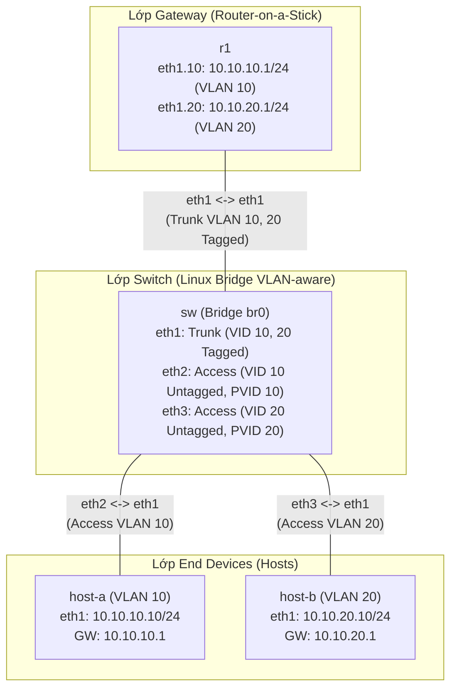

**Language / Ngôn ngữ:** [English](lab-guide_en.md) | [Tiếng Việt](lab-guide.md)

# Bài 04: VLAN Trunking Trên Linux Bridge

**Arc 1 — Networking nền tảng nâng cao**

## Mục tiêu
- Dịch khái niệm VLAN access port / trunk port (quen thuộc từ switch Cisco) sang Linux bridge (`bridge vlan`, VLAN-aware bridge).
- Cấu hình router-on-a-stick trên Linux bằng sub-interface 802.1Q (`ip link ... type vlan`).
- Xác nhận 2 VLAN tách biệt ở lớp 2, chỉ liên lạc được qua router.

## Yêu cầu tiên quyết
Hoàn thành [02-ip-subnetting-thuc-chien](../02-ip-subnetting-thuc-chien/lab-guide.md) — quen thao tác gán IP thủ công qua `docker exec`.

## Sơ đồ topology

- `SW`: đã có sẵn 1 Linux bridge VLAN-aware (`br0`), 3 cổng đã enslave vào bridge — **chưa gán VLAN cho từng cổng**.
- `R1`: đã bật `ip_forward` — **chưa có sub-interface VLAN nào**.

Chi tiết xem [`topology/vlan-lab.clab.yml`](./topology/vlan-lab.clab.yml).

## Đề bài / Yêu cầu

1. Trên `SW`, cấu hình VLAN cho từng cổng của bridge `br0` (dùng `bridge vlan add/del`):
   - `eth1` (nối R1): **trunk port**, phải mang được cả VLAN 10 và VLAN 20 (tagged).
   - `eth2` (nối host-a): **access port** VLAN 10 (untagged, PVID 10).
   - `eth3` (nối host-b): **access port** VLAN 20 (untagged, PVID 20).
2. Trên `R1`, tạo 2 sub-interface 802.1Q trên `eth1`: 1 cho VLAN 10, 1 cho VLAN 20. Gán IP:
   - VLAN 10: mạng `10.10.10.0/24`, R1 nhận `.1`
   - VLAN 20: mạng `10.10.20.0/24`, R1 nhận `.1`
3. Gán IP cho `host-a` (`10.10.10.10/24`, default gateway `10.10.10.1`) và `host-b` (`10.10.20.10/24`, default gateway `10.10.20.1`). Dùng `ip route replace default via <ip> dev eth1` (không dùng `add`) vì container đã có sẵn default route qua `eth0` mgmt.
4. Verify:
   - `host-a` ping `host-b` **phải đi được** (đi qua R1 — inter-VLAN routing).
   - Trên `SW`, chạy `bridge vlan show` — xác nhận đúng cấu hình 3 cổng.
   - Trên `R1`, chạy `ip -d link show` — xác nhận 2 sub-interface VLAN đã lên.
5. Ghi lại: output `bridge vlan show` trên SW, output sub-interface trên R1, và kết quả ping.

## Gợi ý
- Bridge VLAN-aware mặc định gán VID 1 cho mọi cổng khi mới enslave — cần xoá VID 1 mặc định trước khi thêm VID đúng, nếu không port có thể dính 2 VLAN cùng lúc.
- Nếu thiếu lệnh `bridge`, cài thêm gói `iproute2` trong container `SW`.
- Nếu `host-a` ping `host-b` không qua được, kiểm tra tag VLAN trên cổng trunk (`eth1` của SW) đã có đủ cả 2 VID chưa.

## Thảo luận và hỏi đáp
Bài tập này tự làm và tự xác minh kết quả. Nếu có thắc mắc hoặc cần trao đổi thêm, các bạn hãy đăng bài thảo luận trên group Facebook [Network Thực Chiến](https://www.facebook.com/profile.php?id=61591373979991).
## Bài tiếp theo
→ [05-stp-rstp-chong-loop](../05-stp-rstp-chong-loop/lab-guide.md): STP/RSTP chống loop Layer 2.
