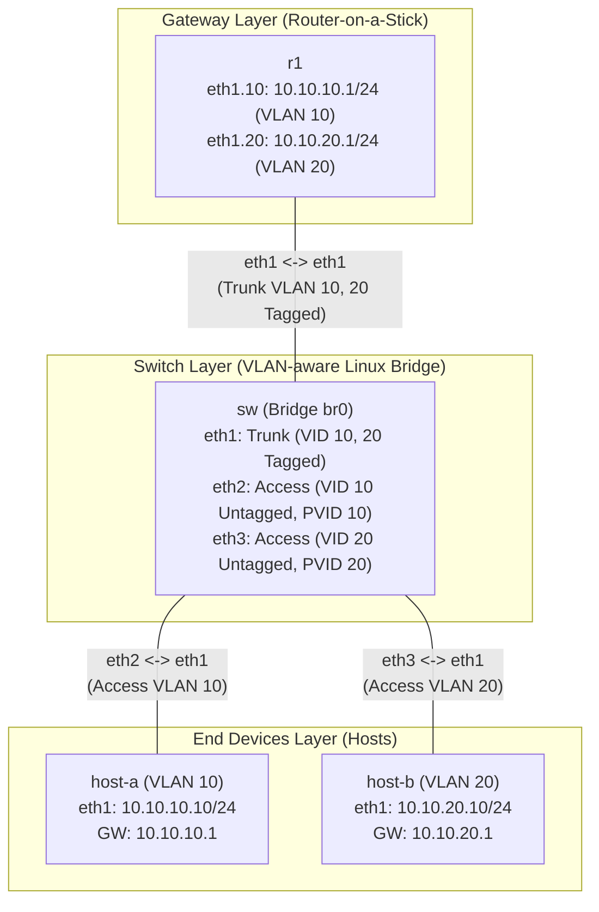

**Language / Ngôn ngữ:** [English](lab-guide_en.md) | [Tiếng Việt](lab-guide.md)

# Lab 04: VLAN Trunking on Linux Bridge

**Arc 1 — Advanced Networking Fundamentals** | 🎥 **Video Tutorial:** [YouTube - VLAN Trunking on Linux Bridge](https://youtu.be/cag4fFk5uNc)

## Objectives
- Translate standard enterprise switch VLAN concepts (Access ports / Trunk ports) to Linux bridge constructs (`bridge vlan`, VLAN-aware bridge).
- Configure Router-on-a-Stick on Linux using 802.1Q sub-interfaces (`ip link ... type vlan`).
- Verify L2 isolation between VLANs and validate inter-VLAN routing via the gateway router.

## Prerequisites
Completion of [02-ip-subnetting-thuc-chien](../02-ip-subnetting-thuc-chien/lab-guide_en.md) — familiarity with manual IP assignment inside containers via `docker exec`.

## Topology Diagram

- `SW`: Pre-configured with a VLAN-aware Linux bridge (`br0`) with 3 enslaved interfaces — **VLANs have not yet been assigned to individual ports**.
- `R1`: `ip_forward` enabled — **sub-interfaces have not yet been created**.

See [`topology/vlan-lab.clab.yml`](./topology/vlan-lab.clab.yml).

## Tasks & Instructions

1. On `SW`, configure VLAN parameters for each bridge port on `br0` (using `bridge vlan add/del` commands):
   - `eth1` (connecting R1): **Trunk port**, carrying both VLAN 10 and VLAN 20 (tagged).
   - `eth2` (connecting host-a): **Access port** for VLAN 10 (untagged, PVID 10).
   - `eth3` (connecting host-b): **Access port** for VLAN 20 (untagged, PVID 20).
2. On `R1`, create two 802.1Q sub-interfaces on `eth1`: one for VLAN 10 and one for VLAN 20. Assign IP addresses:
   - VLAN 10: Subnet `10.10.10.0/24`, R1 receives `.1`
   - VLAN 20: Subnet `10.10.20.0/24`, R1 receives `.1`
3. Assign IP addresses to `host-a` (`10.10.10.10/24`, default gateway `10.10.10.1`) and `host-b` (`10.10.20.10/24`, default gateway `10.10.20.1`). Use `ip route replace default via <ip> dev eth1` (instead of `add`) due to pre-existing default management routes on `eth0`.
4. Verification:
   - `host-a` pinging `host-b` **must succeed** (forwarded through R1 via inter-VLAN routing).
   - On `SW`, run `bridge vlan show` — verify 3-port VLAN configuration assignments.
   - On `R1`, run `ip -d link show` — verify both 802.1Q sub-interfaces are operational and tagged correctly.
5. Record your output: `bridge vlan show` on SW + sub-interface configuration output on R1 + ping verification results.

## Technical Hints
- VLAN-aware Linux bridges automatically assign VID 1 untagged/PVID to all enslaved interfaces by default — remove default VID 1 before assigning target VIDs, otherwise ports may belong to multiple untagged VLANs concurrently.
- If the `bridge` utility is missing inside `SW`, install `iproute2` package.
- If inter-VLAN pings fail between `host-a` and `host-b`, verify that the trunk port (`eth1` on SW) is properly configured with tagged VIDs for both 10 and 20.

<details>
<summary><b>💡 Step-by-Step Solution Reference (Click to expand)</b></summary>

### 1. Configure VLANs on Switch (`SW`)

Remove default VID 1 and assign access/trunk VLAN settings on bridge `br0`:

```bash
docker exec -it clab-vlan-lab-sw sh

# 1. Port eth1 (Trunk port to R1 - carries VLAN 10 and VLAN 20 tagged)
bridge vlan del dev eth1 vid 1
bridge vlan add dev eth1 vid 10
bridge vlan add dev eth1 vid 20

# 2. Port eth2 (Access port to host-a - VLAN 10 untagged, PVID 10)
bridge vlan del dev eth2 vid 1
bridge vlan add dev eth2 vid 10 pvid untagged

# 3. Port eth3 (Access port to host-b - VLAN 20 untagged, PVID 20)
bridge vlan del dev eth3 vid 1
bridge vlan add dev eth3 vid 20 pvid untagged

# Verify VLAN configuration
bridge vlan show
```

### 2. Configure Router-on-a-Stick on Router (`R1`)

Create 802.1Q sub-interfaces on `eth1` and assign gateway IP addresses:

```bash
docker exec -it clab-vlan-lab-r1 sh

# Create VLAN 10 & 20 sub-interfaces
ip link add link eth1 name eth1.10 type vlan id 10
ip link add link eth1 name eth1.20 type vlan id 20

# Assign IP addresses
ip addr add 10.10.10.1/24 dev eth1.10
ip addr add 10.10.20.1/24 dev eth1.20

# Bring up interfaces
ip link set eth1.10 up
ip link set eth1.20 up

# Verify sub-interface details
ip -d link show eth1.10
ip -d link show eth1.20
```

### 3. Assign IP & Default Routes on Hosts

**On `host-a` (VLAN 10):**
```bash
docker exec -it clab-vlan-lab-host-a sh
ip addr add 10.10.10.10/24 dev eth1
ip route replace default via 10.10.10.1 dev eth1
```

**On `host-b` (VLAN 20):**
```bash
docker exec -it clab-vlan-lab-host-b sh
ip addr add 10.10.20.10/24 dev eth1
ip route replace default via 10.10.20.1 dev eth1
```

### 4. Verification

From `host-a`, ping `host-b`:
```bash
docker exec -it clab-vlan-lab-host-a ping -c 4 10.10.20.10
```

</details>

## Discussion & Community Support
This lab is self-guided. If you have questions or feedback, discuss them in the [Network Thực Chiến](https://www.facebook.com/profile.php?id=61591373979991) community.

## Next Lab
→ [05-stp-rstp-chong-loop](../05-stp-rstp-chong-loop/lab-guide_en.md): Layer 2 Loop Prevention with STP/RSTP.
