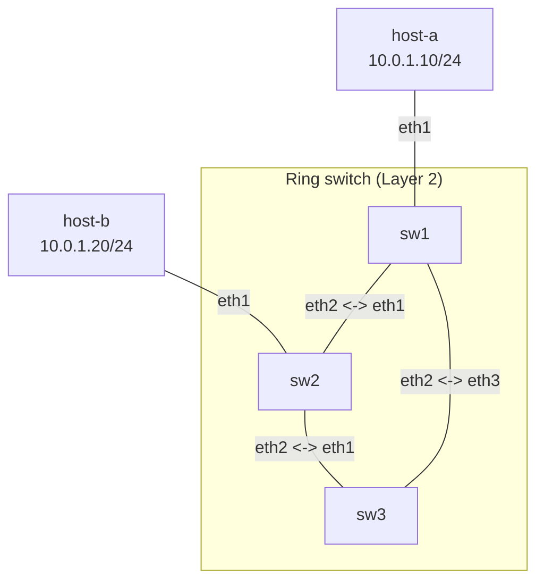

**Language / Ngôn ngữ:** [English](lab-guide_en.md) | [Tiếng Việt](lab-guide.md)

# Bài 05: STP/RSTP — Chống Loop Layer 2

**Arc 1 — Networking nền tảng nâng cao**

## Mục tiêu
- Hiểu vì sao loop Layer 2 gây broadcast storm và cách STP/RSTP giải quyết.
- Quan sát quá trình root bridge election, port state (forwarding/blocking) trên Linux bridge.
- Tự tay bật STP trên 3 switch nối tam giác, xác nhận mạng hội tụ mà không bị loop.

## Yêu cầu tiên quyết
Hoàn thành [04-linux-bridge-vlan](../04-linux-bridge-vlan/lab-guide.md) — quen thao tác tạo Linux bridge, enslave interface.

## Sơ đồ topology
3 switch (Linux bridge) nối thành tam giác, 2 host nối vào sw1 và sw2. Xem [`topology/stp-lab.clab.yml`](./topology/stp-lab.clab.yml).



- `SW1`, `SW2`, `SW3`: mỗi node có 1 bridge `br0` với các interface đã enslave sẵn — **STP chưa bật** (`stp_state 0`).
- `host-a`, `host-b`: cùng subnet `10.0.1.0/24`.

## Đề bài / Yêu cầu

1. Deploy topology. Gán IP cho `host-a` (`10.0.1.10/24`) và `host-b` (`10.0.1.20/24`).
2. **Quan sát vấn đề:** thử ping từ `host-a` đến `host-b` — có thể thông nhưng **không ổn định** (packet duplicate hoặc mất). Chạy `tcpdump -i eth1 icmp` trên `sw3` để thấy gói tin đi vòng (loop) giữa các switch.
3. **Bật STP** trên cả 3 switch:
   ```bash
   ip link set br0 type bridge stp_state 1
   ```
4. Đợi ~10-15 giây (STP convergence), sau đó kiểm tra trạng thái trên mỗi switch:
   ```bash
   bridge link show
   cat /sys/class/net/br0/bridge/root_id
   cat /sys/class/net/br0/bridge/bridge_id
   ```
5. Xác định: **switch nào là root bridge?** (bridge có `bridge_id` nhỏ nhất). Port nào đang ở trạng thái **blocking** (không forward frame)?
6. **Verify:** ping từ `host-a` đến `host-b` phải ổn định, không duplicate. `tcpdump` trên `sw3` phải im lặng (frame bị block ở port dư thừa).
7. **Test failover:** tắt link giữa `sw1` và `sw2` (`ip link set eth2 down` trên `sw1`). Quan sát STP tính lại đường đi — ping vẫn phải thông (đi qua `sw3`), nhưng có thể mất vài giây trong lúc hội tụ.
8. Ghi lại: output `bridge link show` và `root_id`/`bridge_id` trên cả 3 switch (trước và sau khi tắt link), kết quả ping.

## Gợi ý
- STP convergence mặc định trên Linux bridge rất nhanh (vài giây) vì kernel dùng RSTP (802.1w) — nhanh hơn nhiều so với STP cổ điển (802.1D) trên switch Cisco (30-50 giây).
- Bridge ID = priority (mặc định 32768) + MAC address. Muốn ép 1 switch làm root, giảm priority: `ip link set br0 type bridge priority 4096`.
- Nếu muốn xem chi tiết hơn: `bridge -d link show` hiện port state (forwarding/learning/blocking).

## Thảo luận và hỏi đáp
Bài tập này tự làm và tự xác minh kết quả. Nếu có thắc mắc hoặc cần trao đổi thêm, các bạn hãy đăng bài thảo luận trên group Facebook [Network Thực Chiến](https://www.facebook.com/profile.php?id=61591373979991).
## Bài tiếp theo
→ [06-vrrp-ecmp-gateway-ha](../06-vrrp-ecmp-gateway-ha/lab-guide.md): VRRP + ECMP — Gateway HA.
