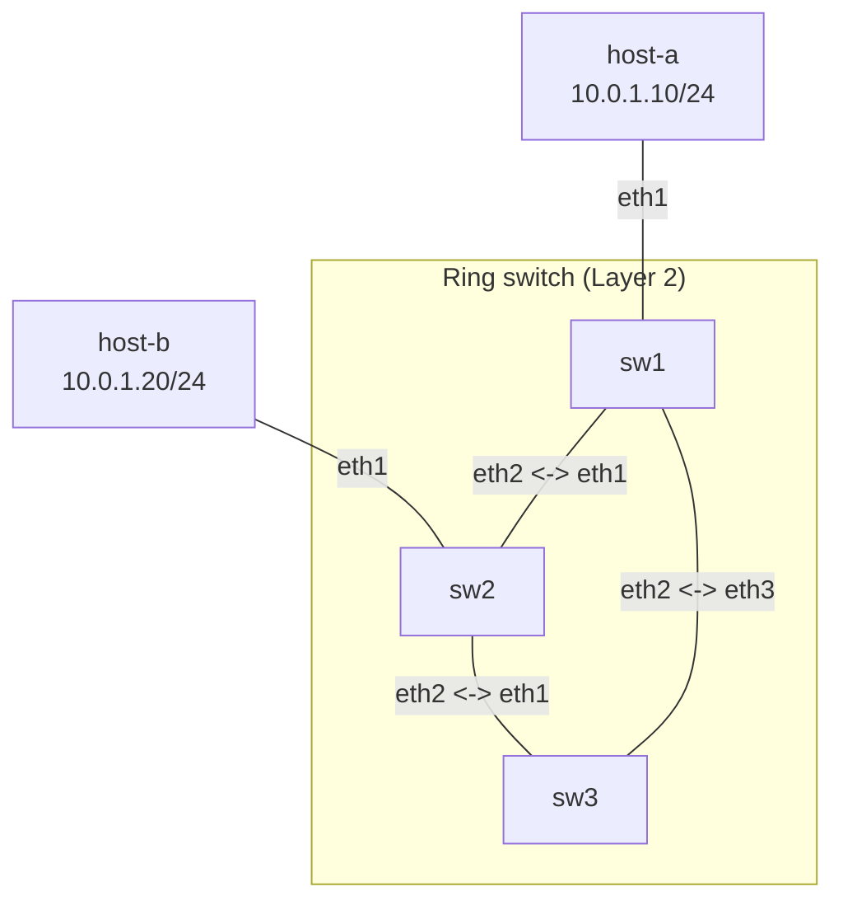

**Language / Ngôn ngữ:** [English](lab-guide_en.md) | [Tiếng Việt](lab-guide.md)

# Lab 05: STP/RSTP — Layer 2 Loop Prevention

**Arc 1 — Advanced Networking Fundamentals**

## Objectives
- Understand why L2 physical loops trigger broadcast storms and how STP/RSTP mitigates them.
- Observe Root Bridge election processes and port states (forwarding/blocking) on Linux bridges.
- Enable STP across a 3-switch triangle topology to achieve converged loop-free Layer 2 forwarding.

## Prerequisites
Completion of [04-linux-bridge-vlan](../04-linux-bridge-vlan/lab-guide_en.md) — familiarity with Linux bridge creation and interface enslavement.

## Topology Diagram
3 switches (Linux bridges) arranged in a physical triangle loop, with 2 hosts attached to sw1 and sw2. See [`topology/stp-lab.clab.yml`](./topology/stp-lab.clab.yml).



- `sw1`, `sw2`, `sw3`: Each node runs bridge `br0` with pre-enslaved interfaces — **STP disabled initially** (`stp_state 0`).
- `host-a`, `host-b`: Reside in subnet `10.0.1.0/24`.

## Tasks & Instructions

1. Deploy topology. Assign IP addresses to `host-a` (`10.0.1.10/24`) and `host-b` (`10.0.1.20/24`).
2. **Observe loop symptoms:** Execute pings from `host-a` to `host-b` — connectivity may work intermittently but display instability (duplicate packets or drops). Run `tcpdump -i eth1 icmp` on `sw3` to observe frames looping infinitely across switches.
3. **Enable STP** across all 3 switches:
   ```bash
   ip link set br0 type bridge stp_state 1
   ```
4. Wait ~10-15 seconds (STP convergence), then inspect status on each switch:
   ```bash
   bridge link show
   cat /sys/class/net/br0/bridge/root_id
   cat /sys/class/net/br0/bridge/bridge_id
   ```
5. Identify: **Which switch became the Root Bridge?** (bridge with the lowest `bridge_id`). Which port entered the **blocking** state (dropping data frames)?
6. **Verify:** Pings from `host-a` to `host-b` must be stable without duplicate packets. `tcpdump` on `sw3` should stay silent (redundant path blocked).
7. **Test Failover:** Shut down the link between `sw1` and `sw2` (`ip link set eth2 down` on `sw1`). Observe STP recalculating topology paths — pings must resume through `sw3` after convergence.
8. Record your output: `bridge link show` output and `root_id`/`bridge_id` across all 3 switches (before and after link teardown) + ping results.

## Technical Hints
- Default STP convergence on Linux bridges is fast (a few seconds) because kernel bridges default to RSTP (802.1w) — significantly faster than legacy 802.1D STP (30-50 seconds).
- Bridge ID = priority (default 32768) + MAC address. To force a specific switch as Root, lower its priority: `ip link set br0 type bridge priority 4096`.
- Detailed port status inspection: `bridge -d link show` displays exact port state (forwarding/learning/blocking).

## Discussion & Community Support
This lab is self-guided. If you have questions or feedback, discuss them in the [Network Thực Chiến](https://www.facebook.com/profile.php?id=61591373979991) community.

## Next Lab
→ [06-vrrp-ecmp-gateway-ha](../06-vrrp-ecmp-gateway-ha/lab-guide_en.md): VRRP + ECMP — Gateway High Availability.
