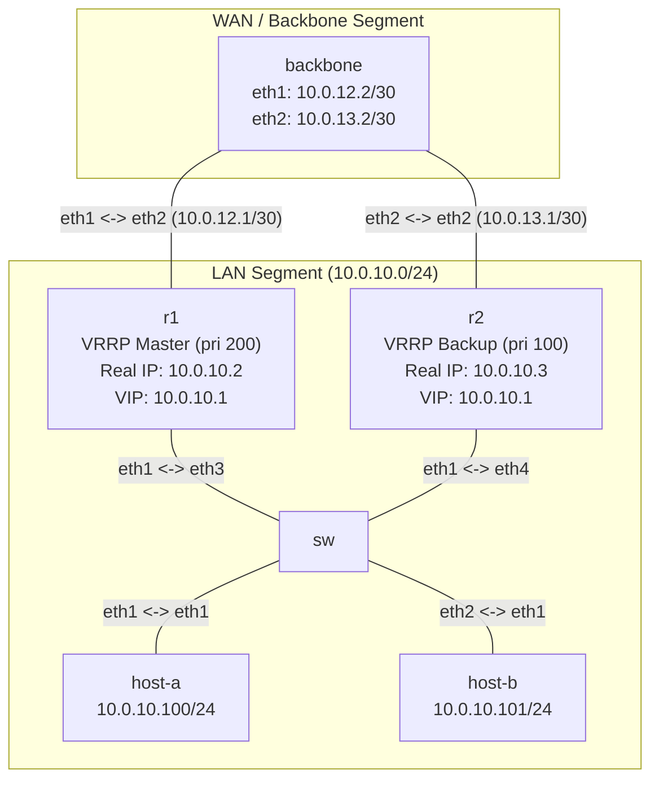

**Language / Ngôn ngữ:** [English](lab-guide_en.md) | [Tiếng Việt](lab-guide.md)

# Bài 06: VRRP + ECMP — Gateway HA

**Arc 1 — Networking nền tảng nâng cao**

## Mục tiêu
- Cấu hình VRRP trên FRR: 2 router chia sẻ 1 Virtual IP (VIP) làm gateway cho LAN.
- Hiểu master/backup election, priority, failover — khi master chết, backup tiếp quản VIP trong vài giây.
- Kết hợp OSPF: backbone router có 2 đường ECMP (Equal-Cost Multi-Path) về LAN qua cả R1 và R2.
- **Lưu ý:** ECMP chỉ tác động chiều **backbone → LAN** (backbone hash chọn R1 hoặc R2 theo từng flow). Chiều **LAN → WAN** (host ra ngoài) luôn đi qua đúng 1 router — VRRP Master tại thời điểm đó — vì host chỉ biết 1 gateway (VIP). Hai cơ chế không chồng lấn.

## Yêu cầu tiên quyết
Hoàn thành [09-ospf-multi-area](../09-ospf-multi-area/lab-guide.md) — quen OSPF cơ bản trên FRR.

## Sơ đồ topology

- `SW`: Linux bridge nối host với cả R1 và R2 (cùng LAN segment `10.0.10.0/24`).
- `R1`: VRRP priority 200 (master), real IP `10.0.10.2`.
- `R2`: VRRP priority 100 (backup), real IP `10.0.10.3`.
- **VIP (Virtual IP):** `10.0.10.1` — host dùng VIP này làm default gateway.
- `backbone`: router trung tâm, OSPF area 0 với cả R1 và R2.

Xem [`topology/vrrp-lab.clab.yml`](./topology/vrrp-lab.clab.yml). OSPF đã cấu hình sẵn, VRRP để `TODO`.

## Đề bài / Yêu cầu

1. Deploy topology. Gán IP + default gateway cho `host-a` (`10.0.10.100/24`, gw `10.0.10.1`) và `host-b` (`10.0.10.101/24`, gw `10.0.10.1`). Nhớ dùng `ip route replace`.
2. **Xác nhận OSPF:** `show ip ospf neighbor` trên R1 và R2 phải thấy backbone neighbor `Full`. `show ip route ospf` trên backbone phải thấy route về `10.0.10.0/24` qua cả R1 và R2 (ECMP — 2 next-hop).
   - **Xác minh ECMP thực sự chia traffic** (không chỉ có 2 route trong bảng): trên `backbone`, chạy `ip route get <dst>` với vài dst khác nhau trong LAN (`10.0.10.100`, `10.0.10.101`, `10.0.10.2`, `10.0.10.3`) — so nexthop trả về (`via 10.0.12.1` = qua R1, `via 10.0.13.1` = qua R2). Phải thấy ít nhất 2 nexthop khác nhau xuất hiện, không phải luôn luôn 1 đường.
3. Trên **R1** và **R2**, hoàn thiện phần VRRP trong FRR config (`vtysh`):
   ```
   interface eth1
     vrrp 10
     vrrp 10 ip 10.0.10.1
     vrrp 10 priority <...>
   ```
   - R1: priority `200` (master)
   - R2: priority `100` (backup)
   - **Bắt buộc dùng VRID `10`** — không đổi số khác. Topology đã tạo sẵn macvlan `vrrp-eth1-10` (MAC `00:00:5e:00:01:0a`) giữ VIP lúc deploy; MAC này cứng theo VRID 10 (byte cuối `0a` = 10 hex). Cấu hình VRID khác sẽ không khớp macvlan có sẵn → `vrrpd` không tìm được interface, kẹt mãi ở `Initialize`, không lên Master/Backup được.
4. Verify VRRP:
   - `show vrrp` trên cả 2 router — R1 phải là **Master**, R2 phải là **Backup**.
   - Từ `host-a`, ping `10.0.10.1` (VIP) → thông. **Lưu ý:** đây chỉ là check "VIP có được cấu hình đúng", KHÔNG dùng để demo failover — ping thẳng vào VIP luôn thành công dù router đang Backup hay đứt hẳn, vì Linux vẫn tự trả lời ICMP cho IP local dù interface đang `protodown`/`NO-CARRIER` (không phải bug của lab, là hành vi kernel). Muốn thấy outage thật, phải ping **xuyên qua** router (bước 5).
   - Từ `host-a`, ping `backbone` (`10.0.12.2` hoặc `10.0.13.2`) → thông (traffic đi qua R1 master, đây mới là traffic forward thật qua router).
5. **Test failover:** tắt interface LAN trên R1 (mô phỏng R1 chết):
   ```bash
   docker exec clab-vrrp-lab-r1 ip link set eth1 down
   ```
   - Đợi 3-5 giây, `show vrrp` trên R2 → **Master**.
   - `host-a` ping `backbone` → vẫn thông, nhưng lần này đi qua R2.
   - **Đo hội tụ định lượng** (thay vì chỉ "đợi 3-5 giây"): trước khi tắt eth1 R1, chạy ping liên tục có timestamp từ host-a: `ping -D -i 0.2 10.0.12.2 | tee /tmp/failover.log`. Giữ ping chạy xuyên suốt lúc tắt eth1. Sau đó đếm số gói timeout liên tiếp trong log — đó là thời gian mất gói thực tế, không phải suy đoán.
   - **Quan sát gratuitous ARP:** mở terminal khác, capture ARP trên `sw` ngay trước khi tắt eth1 R1: `docker exec clab-vrrp-lab-sw tcpdump -i any -e arp -n`. Đồng thời chạy `bridge fdb show` trên `sw` trước và sau failover, so sánh port ánh xạ MAC ảo VRRP (`00:00:5e:00:01:0a`) — port nào MAC ảo chuyển sang? Giải thích trong câu 7.
6. **Khôi phục R1:** `docker exec clab-vrrp-lab-r1 ip link set eth1 up` — R1 phải quay lại Master (preempt mặc định bật trên FRR).
7. Ghi lại kết quả — checklist tự chấm (pass khi đủ cả 8 mục, có output thực tế kèm theo, không mô tả suông):
   - [ ] Config VRRP hoàn chỉnh trên R1 và R2 (đúng VRID, đúng VIP `10.0.10.1`, đúng priority).
   - [ ] Output `show vrrp` lúc bình thường: R1 = Master, R2 = Backup.
   - [ ] Output `show ip route ospf` trên backbone: 2 next-hop (`10.0.12.1`, `10.0.13.1`) về `10.0.10.0/24`.
   - [ ] Output `ip route get` trên backbone với ≥3 dst khác nhau: chứng minh nexthop thực sự chia theo hash.
   - [ ] Log ping `-D` xuyên suốt failover: số gói mất đếm được (không phải ước lượng), kèm giải thích con số đó có hợp lý không.
   - [ ] Output `show vrrp` sau khi tắt eth1 R1: R2 = Master.
   - [ ] `bridge fdb show` trên `sw` trước/sau failover: MAC ảo VRRP chuyển port, kèm giải thích vì sao là FDB switch chứ không phải ARP cache host.
   - [ ] Sau khi bật lại eth1 R1: `show vrrp` xác nhận R1 giành lại Master (preempt).

## Gợi ý
- **FRR `vrrpd` tự nó KHÔNG tạo macvlan giữ VIP** (đây là hành vi thiết kế theo upstream FRR docs, không phải bug) — macvlan `vrrp-eth1-10` đã được topology tự tạo sẵn lúc deploy (xem `exec:` trong `topology/vrrp-lab.clab.yml`), bạn không cần tạo tay. Chỉ cần bật `vrrpd=yes` trong daemons (đã bật sẵn) và cấu hình `vrrp 10 ...` như bước 3.
- Nếu `show vrrp` báo `VRRP interface (v4): None` mãi (không lên Master/Backup): kiểm tra macvlan có tồn tại không — `ip link show vrrp-eth1-10` trên R1/R2. Nếu thiếu, `vrrpd` sẽ log `Refusing to start Virtual Router: No VRRP interface` (bật `log stdout` + `debug vrrp` để thấy).
- Nếu `show vrrp` báo lỗi hoặc trống, kiểm tra `vrrpd` đã chạy chưa: `ps aux | grep vrrpd`.
- **Preempt:** mặc định FRR VRRP bật preempt — khi R1 (priority cao hơn) khôi phục, nó tự giành lại Master. Tắt preempt bằng `vrrp 10 preempt` nếu muốn giữ backup đang chạy.
- **Split-brain (cả 2 router đều Master):** thường do VRID hoặc VIP cấu hình lệch giữa R1/R2 (thành 2 nhóm VRRP khác nhau, không nghe advertisement của nhau), hoặc đứt liên kết đoạn LAN (R1↔SW hoặc R2↔SW) khiến advertisement multicast không tới bên kia dù cả 2 vẫn "sống". Kiểm tra `show run` đối chiếu VRID/VIP hai bên, và trạng thái link (`ip link show eth1`) trước khi kết luận là bug phần mềm.
- **VIP không ping được dù `show vrrp` báo đúng Master:** ít khi do ARP cache trên host — VRRP dùng MAC ảo cố định (`00:00:5e:00:01:<vrid>`), không đổi giữa Master/Backup. Nghi ngờ trước: bảng FDB (CAM table) của switch/bridge chưa cập nhật port mới cho MAC ảo sau failover. Kiểm tra `bridge fdb show` trên `sw`.
- **Đừng tự ping R1↔R2 (real IP, `10.0.10.2`/`10.0.10.3`) trực tiếp từ CLI router** để "test cho chắc" — dễ fail dù mọi thứ đều đúng. Router đang Master có 2 địa chỉ cùng subnet `10.0.10.0/24` (real IP trên `eth1` + VIP trên macvlan) → kernel routing có thể chọn nhầm macvlan để gửi đi, ping tự thân bị rớt dù traffic thật (từ host-a/host-b, đúng cách lab-guide hướng dẫn) hoàn toàn bình thường. Đây là giới hạn cố hữu của kiến trúc macvlan VRRP, không phải lỗi cấu hình — muốn test chính xác thì ép interface: `ping -I eth1 10.0.10.3`.

## So sánh `vrrpd` (FRR) và `keepalived`

Bài này dùng `vrrpd` tích hợp sẵn trong FRR vì R1/R2 đã chạy OSPF trên FRR — gộp control-plane routing và VRRP vào chung 1 daemon/config. Nhưng ngoài đời, **`keepalived`** mới là lựa chọn phổ biến hơn cho bài toán VIP failover, nhất là khi thiết bị không phải router thuần (LB pair, web/app/db server...).

| | `vrrpd` (FRR) | `keepalived` |
|---|---|---|
| Vai trò | 1 daemon trong bộ FRR, dùng chung config/mgmt với `ospfd`/`bgpd` | Standalone — chỉ lo VRRP + healthcheck, không kèm routing suite |
| VIP | Tự tạo macvlan sub-interface giữ VIP, quản state qua `protodown` | Gán VIP trực tiếp bằng `ip addr add` lên interface |
| Config | Trong `frr.conf`, cú pháp `vrrp <vrid> ...` qua `vtysh` | File riêng `/etc/keepalived/keepalived.conf`, cú pháp `vrrp_instance` |
| Healthcheck / hook | Yếu — không có cơ chế theo dõi tầng ứng dụng linh hoạt | Mạnh — `vrrp_script`/`track_script`, `notify_master/backup/fault` để gắn healthcheck app (vd: haproxy còn sống không mới giữ Master) |
| Capability cần | `CAP_NET_ADMIN`/`CAP_NET_RAW` — image FRR chạy daemon dưới user non-root từng bị thiếu cap này, kẹt ở trạng thái `Initialize` mãi | Cũng cần 2 cap trên, nhưng đa số image chạy `keepalived` as root nên ít gặp vấn đề này |
| Dùng khi | Thiết bị đã là router chạy FRR full stack (OSPF/BGP), muốn gộp VRRP vào cùng control-plane | Thiết bị không chạy routing suite (LB, app/db pair) — chỉ cần VIP failover + healthcheck app-level |

**Thực tế triển khai:** phần lớn production dùng `keepalived` cho HA gateway/LB pair (kinh điển: `haproxy` + `keepalived`) nhờ hook script linh hoạt và track record lâu năm. `vrrpd` FRR chỉ đáng cân nhắc khi thiết bị đã là router FRR đang chạy OSPF/BGP sẵn — đúng như tình huống bài này.

## Lời giải tham khảo

<details>
<summary>⚠️ Bấm để xem lời giải — chỉ mở sau khi đã tự làm hết các bước!</summary>

### Config VRRP hoàn chỉnh

Điều kiện tiên quyết (đã có sẵn, không cần làm): macvlan `vrrp-eth1-10` (MAC `00:00:5e:00:01:0a`, mang VIP `10.0.10.1/24`) được topology tạo lúc deploy — FRR `vrrpd` **không tự tạo** macvlan này (xem `doc/user/vrrp.rst` upstream: "it does not create those system interfaces - they must be configured outside of FRR"). Nếu tự dựng topology tương tự từ đầu, đây là bước hay bị bỏ sót nhất khiến `show vrrp` kẹt mãi ở `Initialize`.

**R1** (qua `vtysh`):
```
conf t
interface eth1
  vrrp 10
  vrrp 10 ip 10.0.10.1
  vrrp 10 priority 200
```

**R2**:
```
conf t
interface eth1
  vrrp 10
  vrrp 10 ip 10.0.10.1
  vrrp 10 priority 100
```

### Vì sao ECMP không áp dụng chiều LAN → WAN

Host dùng VIP làm gateway — tại một thời điểm, VIP chỉ tồn tại (trả lời ARP) trên **đúng 1 router**: router đang là VRRP Master. Mọi gói host gửi ra ngoài đều nhắm cùng 1 MAC ảo, luôn đi vào đúng 1 router vật lý — không có gì để "chia".

ECMP trên `backbone` chỉ tác động gói tin **đi từ backbone vào LAN**. Ở hướng này `backbone` có 2 route hợp lệ về cùng subnet (qua R1 và qua R2, cả hai đều đúng về IP routing bất kể ai đang là VRRP Master), nên kernel hash theo flow để rải qua 2 nexthop.

Kết quả: LAN→WAN luôn gom về 1 router (VRRP quyết định); WAN→LAN có thể tách qua 2 router (ECMP quyết định) — hai cơ chế độc lập, không mâu thuẫn nhưng cũng không cộng hưởng theo kiểu "cả 2 chiều đều load-share".

### Kết quả kỳ vọng — xác minh ECMP hash

`ip route get` trên `backbone` với 4 dst khác nhau không nên ra cùng 1 nexthop hết. Ví dụ điển hình: `.100` và `.2` ra `via 10.0.12.1` (qua R1), `.101` và `.3` ra `via 10.0.13.1` (qua R2). Tỉ lệ chia không nhất thiết đều 50/50 với vài dst lẻ tẻ, nhưng phải thấy ít nhất 2 nexthop khác nhau xuất hiện.

### Kết quả kỳ vọng — đo hội tụ

**Quan trọng: phải ping `backbone` (traffic forward qua router), KHÔNG ping VIP.** Ping thẳng VIP luôn thành công 0% loss bất kể failover, vì Linux vẫn tự trả lời ICMP cho IP cấu hình local trên interface dù đang `protodown`/`NO-CARRIER` — không phản ánh trạng thái forwarding thật. Test đo thực tế trên topology này (`ping -D -i 0.1 10.0.12.2` xuyên suốt lúc `ip link set eth1 down`): mất khoảng **45-50 gói liên tiếp (~4.5-5s)** — khớp với ước lượng "3-5 giây" trong đề bài (Master Down Interval ≈ 3x advertisement interval mặc định 1s, cộng thời gian OSPF/FDB hội tụ lại). Nếu đo ra loss gần 0 dù đã tắt hẳn `eth1`, gần như chắc chắn là đang lỡ ping nhầm VIP thay vì `backbone`.

### Kết quả kỳ vọng — gratuitous ARP / FDB

R2 gửi gratuitous ARP cho VIP bằng MAC ảo VRRP ngay khi lên Master — `tcpdump -e arp` trên `sw` sẽ thấy gói này. Điểm hay bị hiểu nhầm: MAC ảo **không đổi** giữa Master/Backup (cố định theo VRID), nên ARP cache trên host không cần cập nhật gì cả. Cái thực sự đổi là **bảng FDB của switch** — gratuitous ARP có tác dụng chính là buộc switch học lại MAC ảo đang ở port nào (từ port R1 sang port R2). `bridge fdb show` phải phản ánh thay đổi này.

### Troubleshooting bổ sung

**Split-brain (cả 2 Master):**
- Nguyên nhân: VRID/VIP lệch giữa R1-R2 (thành 2 nhóm VRRP riêng, không nghe advertisement nhau), hoặc đứt link đoạn LAN R1↔SW↔R2 khiến multicast advertisement (224.0.0.18) không tới bên kia dù cả 2 vẫn sống.
- Chẩn đoán: `show run` đối chiếu VRID/VIP hai bên; `ip link show eth1` kiểm tra link LAN.
- Sửa: đồng bộ VRID/VIP; khôi phục link LAN nếu đứt.

**VIP không ping được dù `show vrrp` báo Master:**
- Nguyên nhân: bảng FDB switch chưa cập nhật port mới cho MAC ảo VRRP sau failover (không phải ARP cache host, vì MAC ảo cố định).
- Chẩn đoán: `bridge fdb show` trên `sw`, xem MAC ảo đang trỏ port nào so với port thực của router đang Master.
- Sửa: gratuitous ARP đáng lẽ tự flush FDB switch — đây chính là mục đích của nó trong VRRP. Nếu không thấy tự cập nhật, đó là dấu hiệu bug/misconfig đáng điều tra tiếp, không phải lỗi thao tác của học viên.

</details>

## Thảo luận và hỏi đáp
Bài tập này tự làm và tự xác minh kết quả. Nếu có thắc mắc hoặc cần trao đổi thêm, các bạn hãy đăng bài thảo luận trên group Facebook [Network Thực Chiến](https://www.facebook.com/profile.php?id=61591373979991).
## Bài tiếp theo
→ [07-dhcp-server-relay](../07-dhcp-server-relay/lab-guide.md): DHCP Server trên Linux (dnsmasq).
