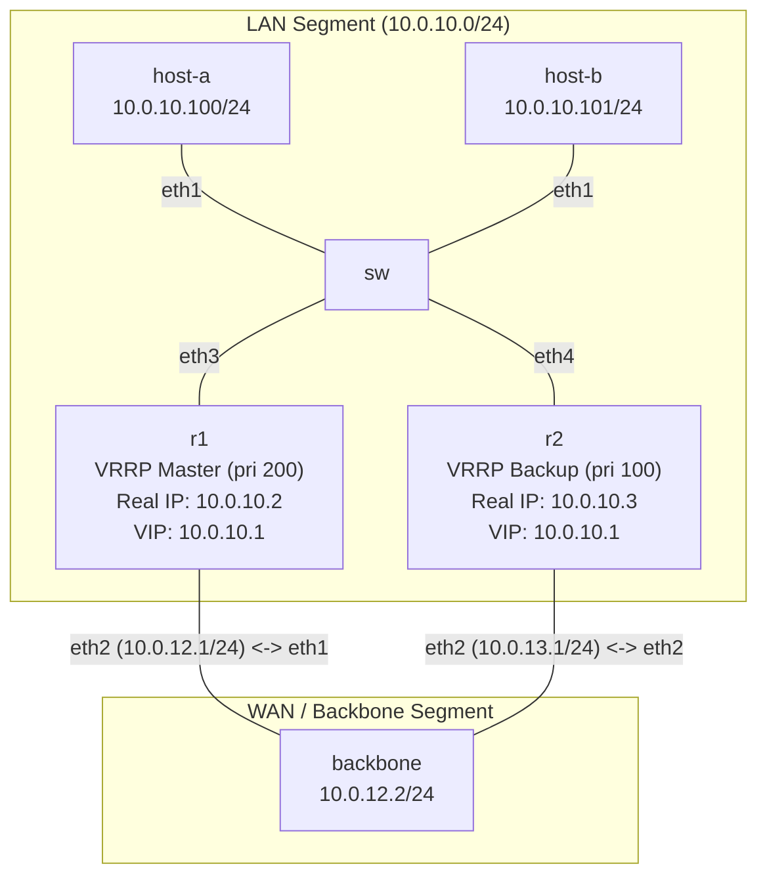

# Bài 06: VRRP + ECMP — Gateway HA

**Arc 1 — Networking nền tảng nâng cao**

## Mục tiêu
- Cấu hình VRRP trên FRR: 2 router chia sẻ 1 Virtual IP (VIP) làm gateway cho LAN.
- Hiểu master/backup election, priority, failover — khi master chết, backup tiếp quản VIP trong vài giây.
- Kết hợp OSPF: backbone router có 2 đường ECMP (Equal-Cost Multi-Path) về LAN qua cả R1 và R2.

## Yêu cầu tiên quyết
Hoàn thành [09-ospf-multi-area](../09-ospf-multi-area/lab-guide.md) — quen OSPF cơ bản trên FRR.

## Sơ đồ topology

- `SW`: Linux bridge nối host với cả R1 và R2 (cùng LAN segment `10.0.10.0/24`).
- `R1`: VRRP priority 200 (master), real IP `10.0.10.2`.
- `R2`: VRRP priority 100 (backup), real IP `10.0.10.3`.
- **VIP (Virtual IP):** `10.0.10.1` — host dùng VIP này làm default gateway.
- `backbone`: router trung tâm, OSPF area 0 với cả R1 và R2.

Xem [`topology/vrrp-lab.clab.yml`](./topology/vrrp-lab.clab.yml). OSPF đã cấu hình sẵn, VRRP để `TODO`.

## Đề bài / Yêu cầu

1. Deploy topology. Gán IP + default gateway cho `host-a` (`10.0.10.100/24`, gw `10.0.10.1`) và `host-b` (`10.0.10.101/24`, gw `10.0.10.1`). Nhớ dùng `ip route replace`.
2. **Xác nhận OSPF:** `show ip ospf neighbor` trên R1 và R2 phải thấy backbone neighbor `Full`. `show ip route ospf` trên backbone phải thấy route về `10.0.10.0/24` qua cả R1 và R2 (ECMP — 2 next-hop).
3. Trên **R1** và **R2**, hoàn thiện phần VRRP trong FRR config (`vtysh`):
   ```
   interface eth1
     vrrp 10
     vrrp 10 ip 10.0.10.1
     vrrp 10 priority <...>
   ```
   - R1: priority `200` (master)
   - R2: priority `100` (backup)
4. Verify VRRP:
   - `show vrrp` trên cả 2 router — R1 phải là **Master**, R2 phải là **Backup**.
   - Từ `host-a`, ping `10.0.10.1` (VIP) → thông.
   - Từ `host-a`, ping `backbone` (`10.0.12.2` hoặc `10.0.13.2`) → thông (traffic đi qua R1 master).
5. **Test failover:** tắt interface LAN trên R1 (mô phỏng R1 chết):
   ```bash
   docker exec clab-vrrp-lab-r1 ip link set eth1 down
   ```
   - Đợi 3-5 giây, `show vrrp` trên R2 → **Master**.
   - `host-a` ping `backbone` → vẫn thông, nhưng lần này đi qua R2.
6. **Khôi phục R1:** `docker exec clab-vrrp-lab-r1 ip link set eth1 up` — R1 phải quay lại Master (preempt mặc định bật trên FRR).
7. Ghi lại: config VRRP 2 router, output `show vrrp` trước/sau failover, output `show ip route` trên backbone (thấy ECMP), kết quả ping.

## Gợi ý
- FRR VRRP (`vrrpd`) tự tạo macvlan sub-interface để giữ VIP — không cần tạo tay. Chỉ cần bật `vrrpd=yes` trong daemons (đã bật sẵn).
- Nếu `show vrrp` báo lỗi hoặc trống, kiểm tra `vrrpd` đã chạy chưa: `ps aux | grep vrrpd`.
- **Preempt:** mặc định FRR VRRP bật preempt — khi R1 (priority cao hơn) khôi phục, nó tự giành lại Master. Tắt preempt bằng `vrrp 10 preempt` nếu muốn giữ backup đang chạy.

## Cách nộp bài
Đăng config VRRP + output `show vrrp` (trước/sau failover) + kết quả ping vào Facebook group/comment bài viết tuần này.
**Hạn nộp:** 1 tuần kể từ ngày đăng bài.

## Bài tiếp theo
→ [07-dhcp-server-relay](../07-dhcp-server-relay/lab-guide.md): DHCP Server trên Linux (dnsmasq).
