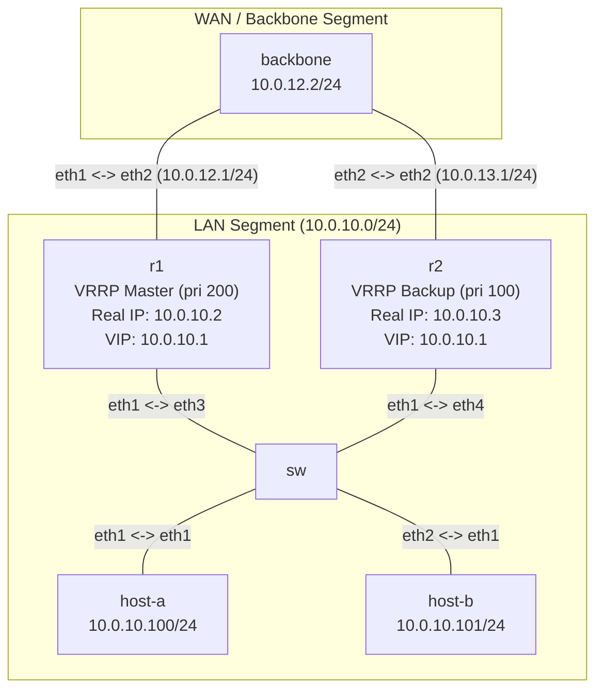

# Bài 06: VRRP + ECMP — Gateway HA

**Arc 1 — Networking nền tảng nâng cao**

## Mục tiêu
- Cấu hình VRRP trên FRR: 2 router chia sẻ 1 Virtual IP (VIP) làm gateway cho LAN.
- Hiểu master/backup election, priority, failover — khi master chết, backup tiếp quản VIP trong vài giây.
- Kết hợp OSPF: backbone router có 2 đường ECMP (Equal-Cost Multi-Path) về LAN qua cả R1 và R2.

## Yêu cầu tiên quyết
Hoàn thành [09-ospf-multi-area](../09-ospf-multi-area/lab-guide.md) — quen OSPF cơ bản trên FRR.

## Sơ đồ topology

- `SW`: Linux bridge nối host với cả R1 và R2 (cùng LAN segment `10.0.10.0/24`).
- `R1`: VRRP priority 200 (master), real IP `10.0.10.2`.
- `R2`: VRRP priority 100 (backup), real IP `10.0.10.3`.
- **VIP (Virtual IP):** `10.0.10.1` — host dùng VIP này làm default gateway.
- `backbone`: router trung tâm, OSPF area 0 với cả R1 và R2.

Xem [`topology/vrrp-lab.clab.yml`](./topology/vrrp-lab.clab.yml). OSPF đã cấu hình sẵn, VRRP để `TODO`.

## Đề bài / Yêu cầu

1. Deploy topology. Gán IP + default gateway cho `host-a` (`10.0.10.100/24`, gw `10.0.10.1`) và `host-b` (`10.0.10.101/24`, gw `10.0.10.1`). Nhớ dùng `ip route replace`.
2. **Xác nhận OSPF:** `show ip ospf neighbor` trên R1 và R2 phải thấy backbone neighbor `Full`. `show ip route ospf` trên backbone phải thấy route về `10.0.10.0/24` qua cả R1 và R2 (ECMP — 2 next-hop).
3. Trên **R1** và **R2**, hoàn thiện phần VRRP trong FRR config (`vtysh`):
   ```
   interface eth1
     vrrp 10
     vrrp 10 ip 10.0.10.1
     vrrp 10 priority <...>
   ```
   - R1: priority `200` (master)
   - R2: priority `100` (backup)
4. Verify VRRP:
   - `show vrrp` trên cả 2 router — R1 phải là **Master**, R2 phải là **Backup**.
   - Từ `host-a`, ping `10.0.10.1` (VIP) → thông.
   - Từ `host-a`, ping `backbone` (`10.0.12.2` hoặc `10.0.13.2`) → thông (traffic đi qua R1 master).
5. **Test failover:** tắt interface LAN trên R1 (mô phỏng R1 chết):
   ```bash
   docker exec clab-vrrp-lab-r1 ip link set eth1 down
   ```
   - Đợi 3-5 giây, `show vrrp` trên R2 → **Master**.
   - `host-a` ping `backbone` → vẫn thông, nhưng lần này đi qua R2.
6. **Khôi phục R1:** `docker exec clab-vrrp-lab-r1 ip link set eth1 up` — R1 phải quay lại Master (preempt mặc định bật trên FRR).
7. Ghi lại: config VRRP 2 router, output `show vrrp` trước/sau failover, output `show ip route` trên backbone (thấy ECMP), kết quả ping.

## Gợi ý
- FRR VRRP (`vrrpd`) tự tạo macvlan sub-interface để giữ VIP — không cần tạo tay. Chỉ cần bật `vrrpd=yes` trong daemons (đã bật sẵn).
- Nếu `show vrrp` báo lỗi hoặc trống, kiểm tra `vrrpd` đã chạy chưa: `ps aux | grep vrrpd`.
- **Preempt:** mặc định FRR VRRP bật preempt — khi R1 (priority cao hơn) khôi phục, nó tự giành lại Master. Tắt preempt bằng `vrrp 10 preempt` nếu muốn giữ backup đang chạy.

## So sánh `vrrpd` (FRR) và `keepalived`

Bài này dùng `vrrpd` tích hợp sẵn trong FRR vì R1/R2 đã chạy OSPF trên FRR — gộp control-plane routing và VRRP vào chung 1 daemon/config. Nhưng ngoài đời, **`keepalived`** mới là lựa chọn phổ biến hơn cho bài toán VIP failover, nhất là khi thiết bị không phải router thuần (LB pair, web/app/db server...).

| | `vrrpd` (FRR) | `keepalived` |
|---|---|---|
| Vai trò | 1 daemon trong bộ FRR, dùng chung config/mgmt với `ospfd`/`bgpd` | Standalone — chỉ lo VRRP + healthcheck, không kèm routing suite |
| VIP | Tự tạo macvlan sub-interface giữ VIP, quản state qua `protodown` | Gán VIP trực tiếp bằng `ip addr add` lên interface |
| Config | Trong `frr.conf`, cú pháp `vrrp <vrid> ...` qua `vtysh` | File riêng `/etc/keepalived/keepalived.conf`, cú pháp `vrrp_instance` |
| Healthcheck / hook | Yếu — không có cơ chế theo dõi tầng ứng dụng linh hoạt | Mạnh — `vrrp_script`/`track_script`, `notify_master/backup/fault` để gắn healthcheck app (vd: haproxy còn sống không mới giữ Master) |
| Capability cần | `CAP_NET_ADMIN`/`CAP_NET_RAW` — image FRR chạy daemon dưới user non-root từng bị thiếu cap này, kẹt ở trạng thái `Initialize` mãi | Cũng cần 2 cap trên, nhưng đa số image chạy `keepalived` as root nên ít gặp vấn đề này |
| Dùng khi | Thiết bị đã là router chạy FRR full stack (OSPF/BGP), muốn gộp VRRP vào cùng control-plane | Thiết bị không chạy routing suite (LB, app/db pair) — chỉ cần VIP failover + healthcheck app-level |

**Thực tế triển khai:** phần lớn production dùng `keepalived` cho HA gateway/LB pair (kinh điển: `haproxy` + `keepalived`) nhờ hook script linh hoạt và track record lâu năm. `vrrpd` FRR chỉ đáng cân nhắc khi thiết bị đã là router FRR đang chạy OSPF/BGP sẵn — đúng như tình huống bài này.

## Thảo luận và hỏi đáp
Bài tập này tự làm và tự xác minh kết quả. Nếu có thắc mắc hoặc cần trao đổi thêm, các bạn hãy đăng bài thảo luận trên group Facebook [Network Thực Chiến](https://www.facebook.com/profile.php?id=61591373979991).
## Bài tiếp theo
→ [07-dhcp-server-relay](../07-dhcp-server-relay/lab-guide.md): DHCP Server trên Linux (dnsmasq).
