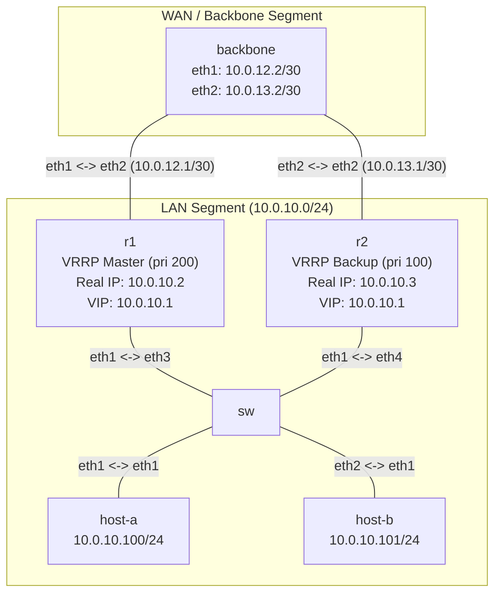

**Language / Ngôn ngữ:** [English](lab-guide_en.md) | [Tiếng Việt](lab-guide.md)

# Lab 06: VRRP + ECMP — Gateway High Availability

**Arc 1 — Advanced Networking Fundamentals** | 🎥 **Video Tutorial:** [YouTube - VRRP + ECMP Gateway HA](https://youtu.be/7SjFpp2h_aM)

## Objectives
- Configure VRRP on FRR: 2 routers share 1 Virtual IP (VIP) as the active default gateway for LAN hosts.
- Master election principles, priority values, and failover — when Master fails, Backup assumes VIP ownership within seconds.
- Combine with OSPF: Backbone router utilizes 2 ECMP (Equal-Cost Multi-Path) routes toward the LAN via both R1 and R2.
- **Note:** ECMP only impacts **Backbone → LAN** traffic (backbone hashes traffic across R1 and R2 per flow). **LAN → WAN** traffic (hosts to outside) always traverses a single active router — the VRRP Master at that instant — because hosts target a single default gateway VIP.

## Prerequisites
Completion of [09-ospf-multi-area](../09-ospf-multi-area/lab-guide_en.md) — basic FRR OSPF configuration.

## Topology Diagram

- `SW`: Linux bridge interconnecting hosts with R1 and R2 on LAN segment `10.0.10.0/24`.
- `R1`: VRRP priority 200 (Master), real IP `10.0.10.2`.
- `R2`: VRRP priority 100 (Backup), real IP `10.0.10.3`.
- **VIP (Virtual IP):** `10.0.10.1` — default gateway for LAN hosts.
- `backbone`: Central router running OSPF Area 0 with R1 and R2.

See [`topology/vrrp-lab.clab.yml`](./topology/vrrp-lab.clab.yml). OSPF is pre-configured; VRRP settings marked `TODO`.

## Tasks & Instructions

1. Deploy topology. Assign IPs and default gateways on `host-a` (`10.0.10.100/24`, gw `10.0.10.1`) and `host-b` (`10.0.10.101/24`, gw `10.0.10.1`). Use `ip route replace`.
2. **Verify OSPF:** `show ip ospf neighbor` on R1 and R2 must display neighbor state `Full`. `show ip route ospf` on `backbone` must display 2 equal-cost routes to `10.0.10.0/24` via R1 and R2.
   - **Verify ECMP load distribution:** on `backbone`, run `ip route get <dst>` for multiple destination IPs in LAN (`10.0.10.100`, `.101`, `.2`, `.3`) — confirm returned nexthops alternate between `10.0.12.1` (R1) and `10.0.13.1` (R2).
3. On **R1** and **R2**, complete VRRP FRR configuration via `vtysh`:
   ```
   interface eth1
     vrrp 10
     vrrp 10 ip 10.0.10.1
     vrrp 10 priority <...>
   ```
   - R1: priority `200` (Master)
   - R2: priority `100` (Backup)
   - **Must use VRID `10`**. Topology topology deployment creates macvlan `vrrp-eth1-10` (MAC `00:00:5e:00:01:0a`) bound to VRID 10.
4. Verify VRRP:
   - `show vrrp` on both routers — R1 must show **Master**, R2 must show **Backup**.
   - From `host-a`, ping `10.0.10.1` (VIP) → must succeed.
   - From `host-a`, ping `backbone` (`10.0.12.2` or `10.0.13.2`) → verify transit forwarding through R1.
5. **Failover Test:** Shut down LAN interface on R1:
   ```bash
   docker exec clab-vrrp-lab-r1 ip link set eth1 down
   ```
   - After 3-5 seconds, `show vrrp` on R2 → must transition to **Master**.
   - `host-a` ping to `backbone` → continues working via R2.
   - **Quantitative Convergence Measurement:** Run continuous timestamped ping from `host-a` before shutting down eth1: `ping -D -i 0.2 10.0.12.2 | tee /tmp/failover.log`. Count dropped packet timestamps.
   - **Observe Gratuitous ARP:** Capture ARP frames on `sw` during failover: `docker exec clab-vrrp-lab-sw tcpdump -i any -e arp -n`. Check switch FDB entries (`bridge fdb show`) before and after failover.
6. **Restore R1:** `docker exec clab-vrrp-lab-r1 ip link set eth1 up` — R1 pre-empts back to Master.
7. Record outputs for submission.

## Technical Hints
- Topology creates `vrrp-eth1-10` automatically on deploy.
- If `show vrrp` shows `VRRP interface (v4): None`, verify macvlan presence via `ip link show vrrp-eth1-10`.
- Preemption is enabled by default in FRR VRRP.

## Discussion & Community Support
This lab is self-guided. If you have questions or feedback, discuss them in the [Network Thực Chiến](https://www.facebook.com/profile.php?id=61591373979991) community.

## Next Lab
→ [07-dhcp-server-relay](../07-dhcp-server-relay/lab-guide_en.md): Linux DHCP Server & Relay (dnsmasq).
