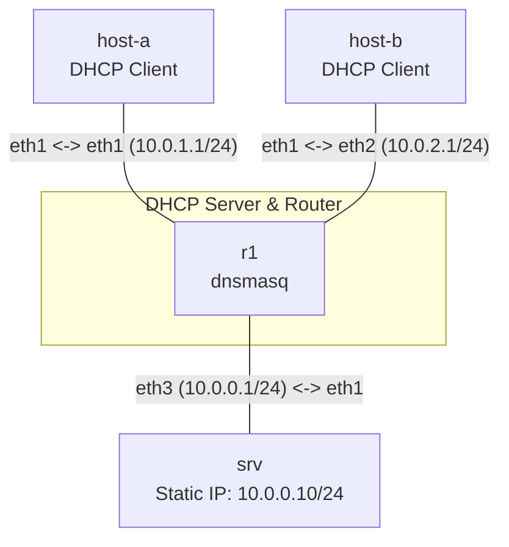

**Language / Ngôn ngữ:** [English](lab-guide_en.md) | [Tiếng Việt](lab-guide.md)

# Bài 07: DHCP Server Trên Linux (dnsmasq)

**Arc 1 — Networking nền tảng nâng cao** | 🎥 **Video hướng dẫn:** [YouTube - Bắt gói tin với Wireshark](https://youtu.be/uJw78eOtZ58)

## Mục tiêu
- Cấu hình DHCP server bằng `dnsmasq` trên router trung tâm — cấp IP tự động cho host trên nhiều subnet.
- Hiểu các thành phần DHCP: pool, lease time, default gateway, DNS server.
- Verify host nhận đúng IP, gateway, DNS từ DHCP, và có thể liên lạc xuyên subnet.

## Yêu cầu tiên quyết
Hoàn thành [02-ip-subnetting-thuc-chien](../02-ip-subnetting-thuc-chien/lab-guide.md) — hiểu subnet, gateway.

## Sơ đồ topology

- `R1`: chạy `dnsmasq` cấp IP cho 2 subnet. DHCP pool và gateway **chưa cấu hình** — tự làm.
- `host-a`, `host-b`: client DHCP, chưa có IP.
- `srv`: server ở subnet trung tâm, có IP tĩnh — dùng để verify routing sau DHCP.

Xem [`topology/dhcp-lab.clab.yml`](./topology/dhcp-lab.clab.yml).

## Đề bài / Yêu cầu

1. Deploy topology. `R1` đã có IP sẵn trên 3 interface và `dnsmasq` đã cài, nhưng **chưa cấu hình DHCP**.
2. Hoàn thiện [`configs/dnsmasq.conf`](./configs/dnsmasq.conf) (đang thiếu phần `dhcp-range`):
   - Subnet `10.0.1.0/24` (eth1): pool `10.0.1.100` – `10.0.1.200`, lease `1h`, gateway `10.0.1.1`.
   - Subnet `10.0.2.0/24` (eth2): pool `10.0.2.100` – `10.0.2.200`, lease `1h`, gateway `10.0.2.1`.
3. Copy file config vào `R1` và khởi động dnsmasq:
   ```bash
   docker cp configs/dnsmasq.conf r1:/etc/dnsmasq.conf
   docker exec r1 dnsmasq --test --conf-file=/etc/dnsmasq.conf   # kiểm tra syntax trước
   docker exec r1 dnsmasq --conf-file=/etc/dnsmasq.conf
   ```
   *(Topology dùng `prefix: ""` nên tên container trùng tên node — `r1`, không phải `clab-dhcp-lab-r1`.)*
4. Trên `host-a` và `host-b`, chạy DHCP client để xin IP:
   ```bash
   udhcpc -i eth1
   ```
5. Verify:
   - `ip addr show eth1` trên `host-a` — phải thấy IP trong range `10.0.1.100–200`.
   - `ip route show` trên `host-a` — phải thấy default gateway là `10.0.1.1`.
   - `host-a` ping `host-b` → thông (đi qua R1).
   - `host-a` ping `srv` (`10.0.0.10`) → thông.
   - Trên `R1`, kiểm tra lease: `cat /var/lib/misc/dnsmasq.leases` — phải thấy 2 lease cho 2 host.
6. Ghi lại: nội dung `dnsmasq.conf`, output `ip addr`/`ip route` trên cả 2 host, output lease trên R1.

## Gợi ý
- `dnsmasq` cần biết interface nào phục vụ DHCP: dùng `interface=eth1` và `interface=eth2` (hoặc `except-interface=eth0` để tránh serve trên mgmt).
- `udhcpc` là DHCP client có sẵn trong Alpine (busybox) — không cần cài thêm.
- Nếu `udhcpc` báo `No lease`, kiểm tra `dnsmasq` đang chạy (`ps aux | grep dnsmasq`) và `dhcp-range` có khớp đúng subnet trên interface không.
- **Bẫy default route:** host đã có sẵn default route qua `eth0` (mgmt của containerlab) nên route gateway từ DHCP có thể không được cài hoặc không được ưu tiên → ping xuyên subnet fail dù đã nhận IP. Xóa route mgmt trước khi xin IP: `ip route del default dev eth0`, rồi chạy lại `udhcpc -i eth1` và kiểm tra `ip route show` thấy `default via 10.0.1.1`.

## Bắt gói tin kiểm chứng DHCP (DORA)
DHCP hoạt động qua 4 bước **D**iscover → **O**ffer → **R**equest → **A**ck. Bắt gói ngay trên `R1` bằng `tcpdump` để nhìn thấy trọn vẹn quá trình:

```bash
# Terminal 1 — bắt gói DHCP trên R1 (port 67 = server, 68 = client)
docker exec -it r1 tcpdump -ni eth1 -v 'port 67 or port 68'

# Terminal 2 — trong lúc tcpdump đang chạy, xin IP trên host-a
docker exec host-a udhcpc -i eth1
```

Kết quả phải thấy đủ 4 gói theo thứ tự:
1. `Discover` — client `0.0.0.0` broadcast tới `255.255.255.255` (chưa có IP).
2. `Offer` — R1 (`10.0.1.1`) đề nghị một IP trong pool.
3. `Request` — client xác nhận muốn nhận IP đó.
4. `ACK` — R1 chốt lease. Với `-v`, đọc được các option cấp xuống: `Subnet-Mask`, `Router 10.0.1.1`, `Lease-Time 3600`.

Muốn phân tích sâu hơn bằng Wireshark (xem [video hướng dẫn](https://youtu.be/uJw78eOtZ58)), lưu file pcap rồi copy ra ngoài:
```bash
docker exec r1 tcpdump -ni eth1 -w /tmp/dhcp.pcap 'port 67 or port 68'
# Ctrl+C sau khi udhcpc xong, rồi:
docker cp r1:/tmp/dhcp.pcap .
```

Câu hỏi tự kiểm tra: tại sao gói `Discover` có source IP `0.0.0.0` và MAC đích broadcast? Nếu bắt trên `eth2` trong lúc `host-a` xin IP thì thấy gì — vì sao?

## Bonus — Static DHCP Reservation
Trong production, server/printer thường cần IP cố định qua DHCP reservation (không phải gán tĩnh). Thử thêm:
1. Lấy MAC address `host-a` eth1: `ip link show eth1`.
2. Thêm `dhcp-host=<mac>,10.0.1.50` vào `dnsmasq.conf`.
3. Restart dnsmasq (`docker exec r1 pkill dnsmasq` rồi chạy lại), renew DHCP trên `host-a` (`udhcpc -i eth1`) — phải nhận đúng `10.0.1.50`.

## Thảo luận và hỏi đáp
Bài tập này tự làm và tự xác minh kết quả. Nếu có thắc mắc hoặc cần trao đổi thêm, các bạn hãy đăng bài thảo luận trên group Facebook [Network Thực Chiến](https://www.facebook.com/profile.php?id=61591373979991).
## Bài tiếp theo
→ [08-nat-masquerade-linux](../08-nat-masquerade-linux/lab-guide.md): NAT/Masquerade trên Linux.
