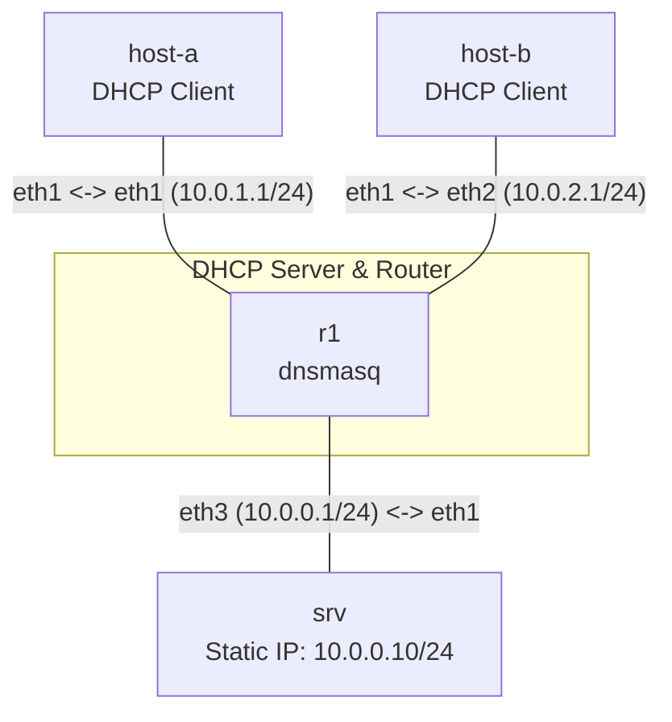

# Bài 07: DHCP Server Trên Linux (dnsmasq)

**Arc 1 — Networking nền tảng nâng cao**

## Mục tiêu
- Cấu hình DHCP server bằng `dnsmasq` trên router trung tâm — cấp IP tự động cho host trên nhiều subnet.
- Hiểu các thành phần DHCP: pool, lease time, default gateway, DNS server.
- Verify host nhận đúng IP, gateway, DNS từ DHCP, và có thể liên lạc xuyên subnet.

## Yêu cầu tiên quyết
Hoàn thành [02-ip-subnetting-thuc-chien](../02-ip-subnetting-thuc-chien/lab-guide.md) — hiểu subnet, gateway.

## Sơ đồ topology

- `R1`: chạy `dnsmasq` cấp IP cho 2 subnet. DHCP pool và gateway **chưa cấu hình** — tự làm.
- `host-a`, `host-b`: client DHCP, chưa có IP.
- `srv`: server ở subnet trung tâm, có IP tĩnh — dùng để verify routing sau DHCP.

Xem [`topology/dhcp-lab.clab.yml`](./topology/dhcp-lab.clab.yml).

## Đề bài / Yêu cầu

1. Deploy topology. `R1` đã có IP sẵn trên 3 interface và `dnsmasq` đã cài, nhưng **chưa cấu hình DHCP**.
2. Hoàn thiện [`configs/dnsmasq.conf`](./configs/dnsmasq.conf) (đang thiếu phần `dhcp-range`):
   - Subnet `10.0.1.0/24` (eth1): pool `10.0.1.100` – `10.0.1.200`, lease `1h`, gateway `10.0.1.1`.
   - Subnet `10.0.2.0/24` (eth2): pool `10.0.2.100` – `10.0.2.200`, lease `1h`, gateway `10.0.2.1`.
3. Copy file config vào `R1` và khởi động dnsmasq:
   ```bash
   docker cp configs/dnsmasq.conf clab-dhcp-lab-r1:/etc/dnsmasq.conf
   docker exec r1 dnsmasq --conf-file=/etc/dnsmasq.conf
   ```
   *(Hoặc nếu dùng `prefix: ""` trong topology, tên container trùng tên node.)*
4. Trên `host-a` và `host-b`, chạy DHCP client để xin IP:
   ```bash
   udhcpc -i eth1
   ```
5. Verify:
   - `ip addr show eth1` trên `host-a` — phải thấy IP trong range `10.0.1.100–200`.
   - `ip route show` trên `host-a` — phải thấy default gateway là `10.0.1.1`.
   - `host-a` ping `host-b` → thông (đi qua R1).
   - `host-a` ping `srv` (`10.0.0.10`) → thông.
   - Trên `R1`, kiểm tra lease: `cat /var/lib/misc/dnsmasq.leases` — phải thấy 2 lease cho 2 host.
6. Ghi lại: nội dung `dnsmasq.conf`, output `ip addr`/`ip route` trên cả 2 host, output lease trên R1.

## Gợi ý
- `dnsmasq` cần biết interface nào phục vụ DHCP: dùng `interface=eth1` và `interface=eth2` (hoặc `except-interface=eth0` để tránh serve trên mgmt).
- `udhcpc` là DHCP client có sẵn trong Alpine (busybox) — không cần cài thêm.
- Nếu `udhcpc` báo `No lease`, kiểm tra `dnsmasq` đang chạy (`ps aux | grep dnsmasq`) và `dhcp-range` có khớp đúng subnet trên interface không.

## Bonus — Static DHCP Reservation
Trong production, server/printer thường cần IP cố định qua DHCP reservation (không phải gán tĩnh). Thử thêm:
1. Lấy MAC address `host-a` eth1: `ip link show eth1`.
2. Thêm `dhcp-host=<mac>,10.0.1.50` vào `dnsmasq.conf`.
3. Restart dnsmasq, renew DHCP trên `host-a` (`udhcpc -i eth1`) — phải nhận đúng `10.0.1.50`.

## Cách nộp bài
Đăng nội dung `dnsmasq.conf` + output verify vào Facebook group/comment bài viết tuần này.
**Hạn nộp:** 1 tuần kể từ ngày đăng bài.

## Bài tiếp theo
→ [08-nat-masquerade-linux](../08-nat-masquerade-linux/lab-guide.md): NAT/Masquerade trên Linux.
