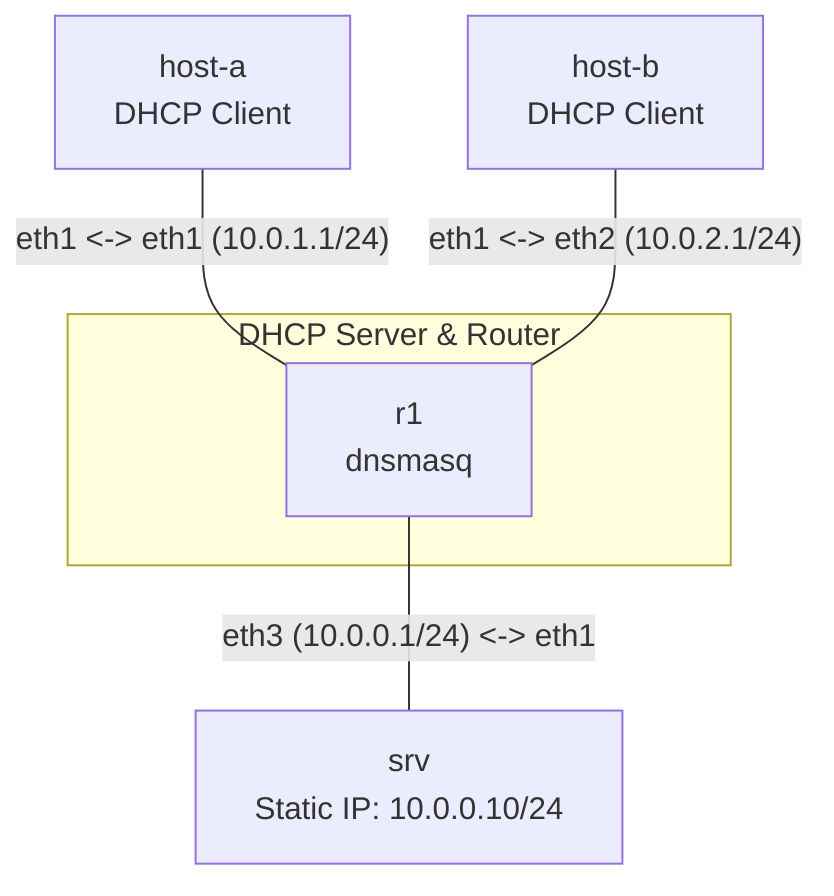

**Language / Ngôn ngữ:** [English](lab-guide_en.md) | [Tiếng Việt](lab-guide.md)

# Lab 07: Linux DHCP Server (dnsmasq)

**Arc 1 — Advanced Networking Fundamentals** | 🎥 **Video Tutorial:** [YouTube - Packet Capture with Wireshark](https://youtu.be/uJw78eOtZ58)

## Objectives
- Configure a Linux DHCP server using `dnsmasq` on a central router — supplying dynamic IP configuration across multiple subnets.
- Understand core DHCP components: address pools, lease durations, default gateways, and DNS servers.
- Verify host containers receive correct IP addresses, default routes, and DNS parameters, validating cross-subnet routing post-acquisition.

## Prerequisites
Completion of [02-ip-subnetting-thuc-chien](../02-ip-subnetting-thuc-chien/lab-guide_en.md) — subnetting and default gateway concepts.

## Topology Diagram

- `R1`: Runs `dnsmasq` providing DHCP services for two LAN subnets. DHCP pools and gateways are **not pre-configured**.
- `host-a`, `host-b`: DHCP client host containers (initially unconfigured).
- `srv`: Central subnet server with a static IP address — used to verify inter-subnet routing after host IP acquisition.

See [`topology/dhcp-lab.clab.yml`](./topology/dhcp-lab.clab.yml).

## Tasks & Instructions

1. Deploy topology. `R1` has pre-assigned IPs across its 3 interfaces and `dnsmasq` installed, but **DHCP services are not yet configured**.
2. Complete [`configs/dnsmasq.conf`](./configs/dnsmasq.conf) (currently missing `dhcp-range` parameters):
   - Subnet `10.0.1.0/24` (eth1): pool `10.0.1.100` – `10.0.1.200`, lease duration `1h`, router gateway `10.0.1.1`.
   - Subnet `10.0.2.0/24` (eth2): pool `10.0.2.100` – `10.0.2.200`, lease duration `1h`, router gateway `10.0.2.1`.
3. Load configuration into `R1` and execute dnsmasq:
   ```bash
   docker cp configs/dnsmasq.conf r1:/etc/dnsmasq.conf
   docker exec r1 dnsmasq --test --conf-file=/etc/dnsmasq.conf   # validate syntax first
   docker exec r1 dnsmasq --conf-file=/etc/dnsmasq.conf
   ```
   *(The topology sets `prefix: ""`, so container names match node names — `r1`, not `clab-dhcp-lab-r1`.)*
4. On `host-a` and `host-b`, run the DHCP client to request IP leases:
   ```bash
   udhcpc -i eth1
   ```
5. Verification:
   - `ip addr show eth1` on `host-a` — confirm assigned IP lies within pool range `10.0.1.100–200`.
   - `ip route show` on `host-a` — confirm default gateway resolves to `10.0.1.1`.
   - `host-a` pings `host-b` → must succeed (routed via R1).
   - `host-a` pings `srv` (`10.0.0.10`) → must succeed.
   - On `R1`, inspect active leases: `cat /var/lib/misc/dnsmasq.leases` — confirm 2 active leases registered.
6. Record output: Complete `dnsmasq.conf` contents + `ip addr`/`ip route` outputs from hosts + active lease output on R1.

## Technical Hints
- Specify listening interfaces in `dnsmasq` using `interface=eth1` and `interface=eth2` (or `except-interface=eth0` to prevent answering requests on management interface).
- `udhcpc` is the default lightweight DHCP client built into Alpine Linux (busybox).
- If `udhcpc` returns `No lease`, verify `dnsmasq` process status (`ps aux | grep dnsmasq`) and check `dhcp-range` subnets match interface subnets exactly.
- **Default route trap:** hosts already have a default route via `eth0` (containerlab management network), so the DHCP-supplied gateway may not be installed or preferred → cross-subnet pings fail even with a valid lease. Remove the management route first: `ip route del default dev eth0`, then re-run `udhcpc -i eth1` and confirm `ip route show` displays `default via 10.0.1.1`.

## Packet Capture Verification (DORA)
DHCP negotiates in 4 steps: **D**iscover → **O**ffer → **R**equest → **A**ck. Capture the exchange directly on `R1` with `tcpdump`:

```bash
# Terminal 1 — capture DHCP traffic on R1 (port 67 = server, 68 = client)
docker exec -it r1 tcpdump -ni eth1 -v 'port 67 or port 68'

# Terminal 2 — while tcpdump is running, request a lease on host-a
docker exec host-a udhcpc -i eth1
```

You should observe all 4 packets in order:
1. `Discover` — client `0.0.0.0` broadcasts to `255.255.255.255` (no IP yet).
2. `Offer` — R1 (`10.0.1.1`) proposes an IP from the pool.
3. `Request` — client formally requests the offered IP.
4. `ACK` — R1 confirms the lease. With `-v`, inspect the delivered options: `Subnet-Mask`, `Router 10.0.1.1`, `Lease-Time 3600`.

For deeper analysis in Wireshark (see the [video tutorial](https://youtu.be/uJw78eOtZ58)), write a pcap file and copy it out:
```bash
docker exec r1 tcpdump -ni eth1 -w /tmp/dhcp.pcap 'port 67 or port 68'
# Ctrl+C once udhcpc completes, then:
docker cp r1:/tmp/dhcp.pcap .
```

Self-check questions: why does the `Discover` packet carry source IP `0.0.0.0` and a broadcast destination MAC? If you capture on `eth2` while `host-a` requests a lease, what do you see — and why?

## Bonus Challenge — Static DHCP Reservation
In production, servers and network printers often require fixed IPs via DHCP reservations. Implement the following:
1. Retrieve MAC address of `host-a` eth1: `ip link show eth1`.
2. Add `dhcp-host=<mac>,10.0.1.50` to `dnsmasq.conf`.
3. Restart dnsmasq (`docker exec r1 pkill dnsmasq`, then start it again) and renew the DHCP lease on `host-a` (`udhcpc -i eth1`) — verify host receives reserved IP `10.0.1.50`.

## Discussion & Community Support
This lab is self-guided. If you have questions or feedback, discuss them in the [Network Thực Chiến](https://www.facebook.com/profile.php?id=61591373979991) community.

## Next Lab
→ [08-nat-masquerade-linux](../08-nat-masquerade-linux/lab-guide_en.md): Linux NAT & Masquerade.
