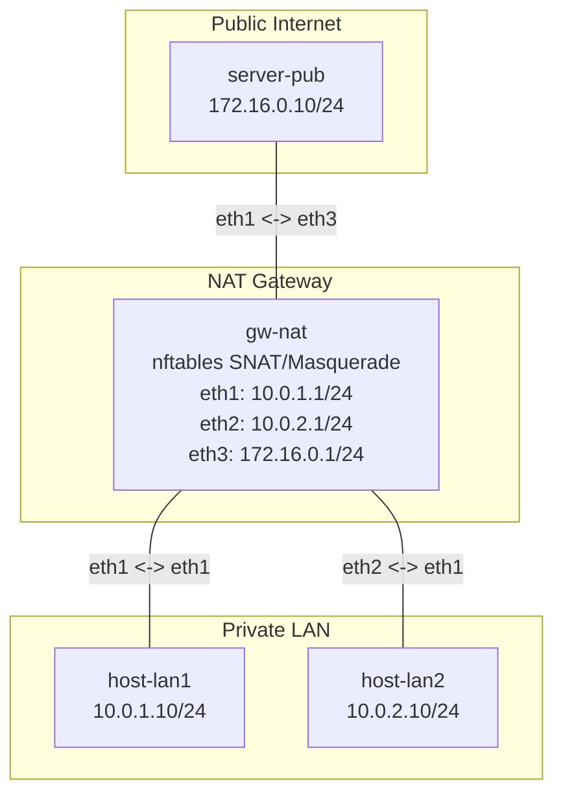

**Language / Ngôn ngữ:** [English](lab-guide_en.md) | [Tiếng Việt](lab-guide.md)

# Lab 08: Linux NAT / Masquerade

**Arc 1 — Advanced Networking Fundamentals**

## Objectives
- Configure Source NAT (masquerade) using `nftables` on Linux — simulating an internal private LAN accessing the internet via a gateway router.
- Understand the difference between fixed SNAT and masquerade (dynamic WAN IP detection).
- Verify NAT operation by capturing source IP addresses on the server — confirming the server sees the gateway WAN IP (NATed) rather than the private internal LAN IP.

## Prerequisites
Completion of [17-nftables-firewall](../17-nftables-firewall/lab-guide.md) — familiarity with `nftables` syntax, tables, chains, and rules.

## Topology Diagram


- `gw-nat`: 3 network interfaces — 2 LAN interfaces (`eth1`: `10.0.1.1/24`, `eth2`: `10.0.2.1/24`), 1 WAN interface (`eth3`: `172.16.0.1/24`).
- `server-pub`: Simulates an internet server (`172.16.0.10/24`).

Refer to [`topology/nat-lab.clab.yml`](./topology/nat-lab.clab.yml).

## Lab Tasks & Instructions

1. Deploy the topology using Containerlab. Interface IP addresses for `gw-nat` and `server-pub` are pre-configured.
2. Assign IP addresses to `host-lan1` (`10.0.1.10/24`, default gw `10.0.1.1`) and `host-lan2` (`10.0.2.10/24`, default gw `10.0.2.1`). Remember to use `ip route replace default`.
3. On `server-pub`, start a TCP listener: `nc -l -p 80 &`.
4. Test connectivity using `ping` and `nc -zv 172.16.0.10 80` from `host-lan1` — **connectivity should fail initially** because `server-pub` lacks a return route back to `10.0.1.0/24` (demonstrating why NAT is necessary).
5. Complete [`nftables/nat-rules.nft`](./nftables/nat-rules.nft) — add a `masquerade` rule for outbound traffic leaving the WAN interface (`eth3`). Load the ruleset into `gw-nat`:
   ```bash
   nft -f nftables/nat-rules.nft
   ```
6. Verification:
   - `host-lan1` pings `server-pub` → **must succeed** (traffic is NATed, server sees source IP `172.16.0.1`).
   - `host-lan2` pings `server-pub` → must succeed.
   - On `server-pub`, run `tcpdump -i eth1 -n` while `host-lan1` pings — confirm the source IP is `172.16.0.1` (WAN IP), **not** `10.0.1.10`.
   - On `gw-nat`, run `nft list ruleset` — verify rule counter increments for the masquerade rule.
7. Record your output: Complete `nat-rules.nft` contents + `tcpdump` output on `server-pub` + `nft list ruleset` output.

## Technical Hints
- `masquerade` belongs inside a `postrouting` chain (hook `postrouting`, type `nat`, priority `srcnat`). This is Source NAT — translating packet source IP address before transmission out to the WAN.
- Difference between `snat to <ip>` vs `masquerade`: SNAT requires specifying a static IP address, while `masquerade` dynamically binds to the outgoing interface's primary IP address — useful for DHCP/dynamic WAN IPs.
- If `nft` command is missing inside a container: `apk add nftables`.

## Bonus Challenge — DNAT (Port Forwarding)
In production, in addition to SNAT (LAN to Internet), **DNAT** (port forwarding from Internet to LAN) is commonly required. Implement the following:
1. DNAT rule: Redirect traffic reaching `gw-nat:eth3` port `8080` to `host-lan1:80` (chain `prerouting`, type `nat`, `dnat to 10.0.1.10:80`).
2. On `host-lan1`, start a listener: `nc -l -p 80`.
3. From `server-pub`: execute `nc -zv 172.16.0.1 8080` → connection to `host-lan1` must succeed.

## Next Lab
→ [09-ospf-multi-area](../09-ospf-multi-area/lab-guide.md): OSPF Multi-Area.
