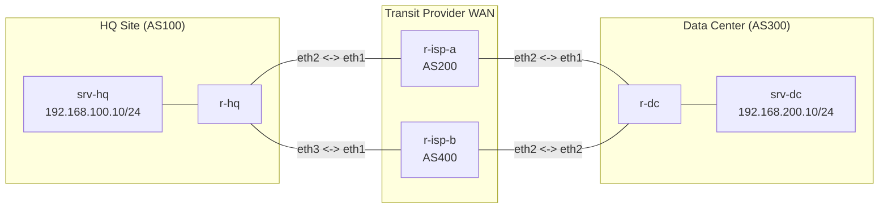

**Language / Ngôn ngữ:** [English](lab-guide_en.md) | [Tiếng Việt](lab-guide.md)

# Bài 12: BGP Local Preference + Prefix-List

**Arc 2 — Routing protocol chuyên sâu**

## Mục tiêu
- Dùng **Local Preference** (LP) to điều khiển inbound path selection — chọn đường đi ra ngoài từ AS nội bộ.
- Dùng **prefix-list** lọc chính xác prefix nào được áp dụng policy — tránh áp nhầm cho toàn bộ route.
- So sánh LP (inbound traffic engineering) với AS-Path Prepend (outbound traffic engineering) đã học ở Bài 11.

## Yêu cầu tiên quyết
Hoàn thành [11-bgp-route-map-policy](../11-bgp-route-map-policy/lab-guide.md) — đã biết route-map cơ bản.

## Sơ đồ topology


- `r-hq` (AS100): router HQ, có 2 uplink đến ISP-A (AS200) và ISP-B (AS400).
- `r-dc` (AS300): router Data Center, cũng có 2 uplink.
- Tất cả eBGP session **đã lên Established**, route đã trao đổi. **Mặc định cả 2 đường có AS-PATH bằng nhau** (đều qua 1 transit AS).

Xem [`topology/bgp-lp-lab.clab.yml`](./topology/bgp-lp-lab.clab.yml).

## Vấn đề cần giải quyết

Mặc định, BGP chọn đường theo AS-PATH ngắn nhất — nhưng cả 2 đường (qua ISP-A và ISP-B) có AS-PATH bằng nhau (đều 2 hop). BGP sẽ dùng tie-breaker (router-id nhỏ nhất) → không kiểm soát được traffic đi đường nào.

**Yêu cầu:** Traffic từ HQ đến DC phải **ưu tiên đi qua ISP-A** (đường chính, băng thông cao), chỉ dùng ISP-B khi ISP-A mất kết nối.

## Đề bài / Yêu cầu

1. **Tạo prefix-list** lọc prefix DC trên `r-hq`:
   ```
   ip prefix-list DC-PREFIXES seq 10 permit 192.168.200.0/24
   ```
2. **Tạo route-map** áp Local Preference cao cho route nhận từ ISP-A:
   ```
   route-map SET-LP-ISP-A permit 10
     match ip address prefix-list DC-PREFIXES
     set local-preference 200
   route-map SET-LP-ISP-A permit 20
   ```
   *(permit 20 không match/set gì → cho phép các route khác đi qua với LP mặc định 100)*
3. **Áp route-map inbound** cho neighbor ISP-A trên `r-hq`:
   ```
   neighbor <ip-isp-a> route-map SET-LP-ISP-A in
   ```
4. **Clear BGP** để áp dụng: `clear ip bgp <ip-isp-a> soft in`.
5. Verify:
   - `show ip bgp 192.168.200.0/24` trên `r-hq` → best path phải qua ISP-A (LP 200 > LP 100).
   - `traceroute` từ `srv-hq` đến `srv-dc` → phải đi qua `r-isp-a`.
   - `show ip bgp` — các route khác (nếu có) không bị ảnh hưởng bởi LP (permit 20 fallthrough).
6. **Test failover:** tắt link HQ-ISP-A (`docker exec r-hq ip link set eth2 down`):
   - BGP session với ISP-A mất → route qua ISP-B (LP 100) trở thành best.
   - `srv-hq` vẫn ping được `srv-dc` (qua ISP-B).
7. Ghi lại: prefix-list + route-map đã viết, output `show ip bgp 192.168.200.0/24`, traceroute.

## Gợi ý
- **LP chỉ có ý nghĩa trong cùng 1 AS** (local) — khác với AS-Path Prepend ảnh hưởng đến AS khác. LP quyết định AS nội bộ chọn đường nào để gửi traffic ra ngoài.
- Route-map **phải có ít nhất 1 permit cuối** (permit 20) để route không khớp prefix-list vẫn được chấp nhận — nếu thiếu, tất cả route khác sẽ bị implicit deny!
- `clear ip bgp ... soft in` chỉ re-process route inbound mà không reset session — an toàn hơn `clear ip bgp *`.

## Thảo luận và hỏi đáp
Bài tập này tự làm và tự xác minh kết quả. Nếu có thắc mắc hoặc cần trao đổi thêm, các bạn hãy đăng bài thảo luận trên group Facebook [Network Thực Chiến](https://www.facebook.com/profile.php?id=61591373979991).
## Bài tiếp theo
→ [13-pbr-dual-wan](../13-pbr-dual-wan/lab-guide.md): Policy-Based Routing dual-WAN.
