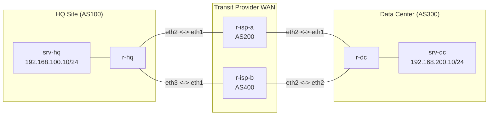

**Language / Ngôn ngữ:** [English](lab-guide_en.md) | [Tiếng Việt](lab-guide.md)

# Lab 12: BGP Local Preference + Prefix-Lists

**Arc 2 — Deep-Dive Routing Protocols**

## Objectives
- Use **Local Preference** (LP) to manipulate inbound path selection — engineering exit traffic routes from an internal AS.
- Use **prefix-lists** to match and target specific prefixes for policy application — preventing unintended policy modifications to other routes.
- Compare Local Preference (inbound traffic engineering) with AS-Path Prepending (outbound traffic engineering) learned in Lab 11.

## Prerequisites
Completion of [11-bgp-route-map-policy](../11-bgp-route-map-policy/lab-guide_en.md) — route-map concepts.

## Topology Diagram

- `r-hq` (AS100): HQ enterprise router with dual uplinks to ISP-A (AS200) and ISP-B (AS400).
- `r-dc` (AS300): Data Center router with dual uplinks.
- All eBGP sessions are **Established** and prefixes exchanged. Both exit paths have **equal AS-path lengths** (2 hops).

See [`topology/bgp-lp-lab.clab.yml`](./topology/bgp-lp-lab.clab.yml).

## Problem Statement
By default, BGP path selection prefers the shortest AS-path. When both uplinks (via ISP-A and ISP-B) present equal AS-path lengths, BGP defaults to tie-breakers (lowest router ID) → leading to deterministic yet unmanaged path selection.

**Requirement:** Traffic from HQ to Data Center must **prefer ISP-A** (primary high-bandwidth link), failing over to ISP-B only when ISP-A is unreachable.

## Tasks & Instructions

1. **Configure a prefix-list** targeting DC subnets on `r-hq`:
   ```
   ip prefix-list DC-PREFIXES seq 10 permit 192.168.200.0/24
   ```
2. **Configure a route-map** assigning a higher Local Preference to routes received from ISP-A:
   ```
   route-map SET-LP-ISP-A permit 10
     match ip address prefix-list DC-PREFIXES
     set local-preference 200
   route-map SET-LP-ISP-A permit 20
   ```
   *(permit 20 without match/set clauses permits unmatched routes with default LP 100)*
3. **Apply the route-map inbound** for neighbor ISP-A on `r-hq`:
   ```
   neighbor <ip-isp-a> route-map SET-LP-ISP-A in
   ```
4. **Refresh BGP tables**: `clear ip bgp <ip-isp-a> soft in`.
5. Verification:
   - `show ip bgp 192.168.200.0/24` on `r-hq` → confirm best path routes via ISP-A (LP 200 > LP 100).
   - `traceroute` from `srv-hq` to `srv-dc` → must transit `r-isp-a`.
   - `show ip bgp` — verify other prefixes remain unaffected (handled by permit sequence 20).
6. **Test Failover:** Shut down HQ–ISP-A interface (`docker exec r-hq ip link set eth2 down`):
   - BGP peering with ISP-A drops → path via ISP-B (LP 100) becomes active best path.
   - `srv-hq` ping to `srv-dc` continues functioning via ISP-B.
7. Record outputs: Prefix-list and route-map configs + `show ip bgp 192.168.200.0/24` output + `traceroute` verification.

## Technical Hints
- **Local Preference operates within a single AS** — unlike AS-Path Prepending which influences adjacent ASes. LP determines how internal routers pick outbound egress points.
- Route-maps **must include a trailing permit clause** (e.g., sequence 20) to prevent implicit deny of unmatched prefixes.
- `clear ip bgp ... soft in` soft-refreshes inbound tables without resetting active TCP sessions.

## Discussion & Community Support
This lab is self-guided. If you have questions or feedback, discuss them in the [Network Thực Chiến](https://www.facebook.com/profile.php?id=61591373979991) community.

## Next Lab
→ [13-pbr-dual-wan](../13-pbr-dual-wan/lab-guide_en.md): Policy-Based Routing Dual-WAN.
