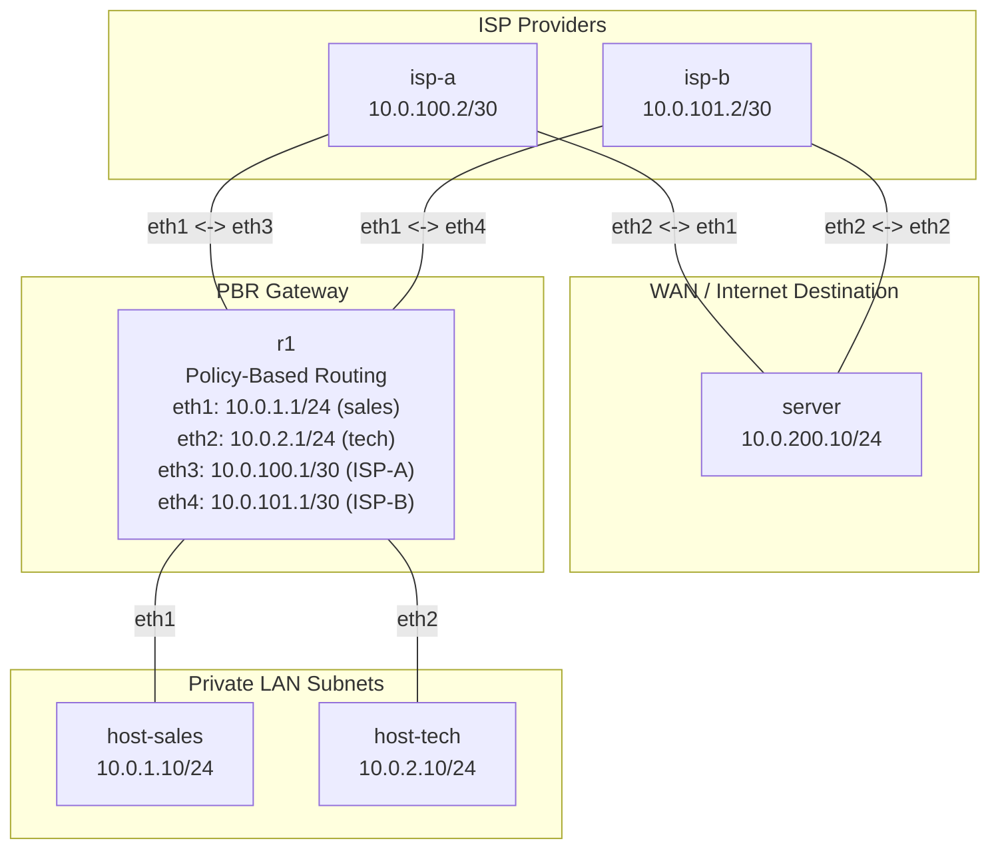

**Language / Ngôn ngữ:** [English](lab-guide_en.md) | [Tiếng Việt](lab-guide.md)

# Bài 13: Policy-Based Routing (PBR) — Dual-WAN

**Arc 2 — Routing protocol chuyên sâu**

## Mục tiêu
- Dùng `ip rule` + multiple routing tables trên Linux để route traffic theo source IP (policy-based routing).
- Mô phỏng kịch bản thực tế: phòng kinh doanh đi ISP-A, phòng kỹ thuật đi ISP-B.
- Verify bằng `traceroute` — xác nhận mỗi phòng ban đi đúng đường ISP riêng.

## Yêu cầu tiên quyết
Hoàn thành [03-static-route-multi-hop](../03-static-route-multi-hop/lab-guide.md) — hiểu static routing trên Linux.

## Sơ đồ topology


- `r1`: 4 interface — 2 LAN (sales, tech), 2 WAN (ISP-A, ISP-B). Đã có IP sẵn, **chưa có PBR rule**.
- `isp-a`, `isp-b`: 2 router mô phỏng 2 nhà mạng khác nhau, cùng kết nối đến `server`.
- `server`: server đích, kết nối cả 2 ISP — dùng verify traffic đến từ đường nào.

Xem [`topology/pbr-lab.clab.yml`](./topology/pbr-lab.clab.yml).

## Đề bài / Yêu cầu

1. Deploy topology. IP đã gán sẵn trên tất cả interface.
2. **Xác nhận ban đầu:** `host-sales` và `host-tech` đều ping `server` được — nhưng cả 2 đều đi cùng 1 đường (default route mặc định trên R1 qua ISP-A, kiểm tra bằng `traceroute`).
3. **Cấu hình PBR** trên `r1`:
   - Tạo routing table riêng cho ISP-A (table ID 100) và ISP-B (table ID 200):
     ```bash
     ip route add default via 10.0.100.2 table 100
     ip route add default via 10.0.101.2 table 200
     ```
   - Thêm `ip rule` route theo source IP:
     ```bash
     ip rule add from 10.0.1.0/24 table 100   # sales → ISP-A
     ip rule add from 10.0.2.0/24 table 200   # tech → ISP-B
     ```
4. Verify:
   - `traceroute` từ `host-sales` đến `server` → phải đi qua **ISP-A** (`10.0.100.2`).
   - `traceroute` từ `host-tech` đến `server` → phải đi qua **ISP-B** (`10.0.101.2`).
   - Trên `r1`: `ip rule show` — phải thấy 2 rule mới. `ip route show table 100` và `table 200` — phải đúng default gateway.
5. Ghi lại: output `ip rule show`, `ip route show table 100/200` trên R1, và `traceroute` từ cả 2 host.

## Gợi ý
- `ip rule` xét **trước** routing table mặc định — rule có priority nhỏ hơn sẽ được check trước. Xem priority bằng `ip rule show`.
- Nếu `traceroute` từ host vẫn đi cùng đường, kiểm tra: (1) `ip rule` đã thêm đúng source prefix chưa, (2) routing table custom có đúng default gateway không.
- **Lưu ý `ip route replace default`:** khi thêm table 100/200, không ảnh hưởng default route trong main table — 2 hệ thống routing song song.

## Bonus — Failover tự động
Trong production, khi ISP-A mất kết nối, traffic sales cần tự chuyển sang ISP-B. Thử:
1. Tắt link ISP-A: `docker exec isp-a ip link set eth1 down`.
2. Quan sát `host-sales` mất kết nối (route qua table 100 đi vào blackhole).
3. Viết 1 script đơn giản kiểm tra `ping -c 1 10.0.100.2`, nếu fail → `ip rule del from 10.0.1.0/24 table 100` để traffic rơi về main table (qua ISP-B).
4. **Mở rộng:** Trong thực tế, dùng `keepalived` hoặc BFD để phát hiện link down nhanh hơn.

## Thảo luận và hỏi đáp
Bài tập này tự làm và tự xác minh kết quả. Nếu có thắc mắc hoặc cần trao đổi thêm, các bạn hãy đăng bài thảo luận trên group Facebook [Network Thực Chiến](https://www.facebook.com/profile.php?id=61591373979991).
## Bài tiếp theo
→ [14-ansible-co-ban](../14-ansible-co-ban/lab-guide.md): Ansible cơ bản.
