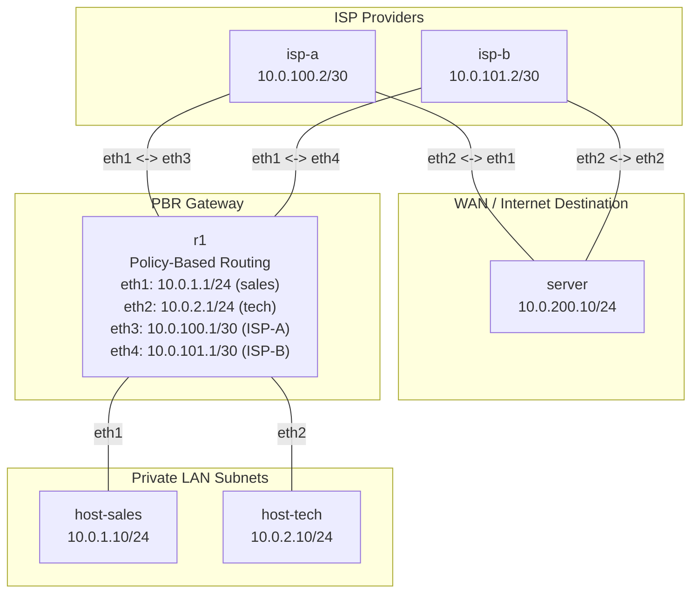

**Language / Ngôn ngữ:** [English](lab-guide_en.md) | [Tiếng Việt](lab-guide.md)

# Lab 13: Policy-Based Routing (PBR) — Dual-WAN

**Arc 2 — Deep-Dive Routing Protocols**

## Objectives
- Implement `ip rule` + multiple routing tables on Linux to forward traffic based on Source IP (Policy-Based Routing).
- Model a common enterprise scenario: Sales department routed out via ISP-A, Engineering department routed out via ISP-B.
- Verify path isolation using `traceroute` — confirming each department egresses via its designated provider.

## Prerequisites
Completion of [03-static-route-multi-hop](../03-static-route-multi-hop/lab-guide_en.md) — Linux static routing fundamentals.

## Topology Diagram

- `r1`: 4 interfaces — 2 LANs (sales, tech), 2 WANs (ISP-A, ISP-B). IPs pre-assigned; **PBR rules not yet configured**.
- `isp-a`, `isp-b`: Routers simulating separate ISPs connecting to `server`.
- `server`: Destination target server connected to both ISPs.

See [`topology/pbr-lab.clab.yml`](./topology/pbr-lab.clab.yml).

## Tasks & Instructions

1. Deploy topology. Interface IPs are pre-assigned across all nodes.
2. **Initial Baseline Check:** `host-sales` and `host-tech` can both ping `server` — but both egress through the default route via ISP-A (verify with `traceroute`).
3. **Configure PBR** on `r1`:
   - Create dedicated routing tables for ISP-A (table ID 100) and ISP-B (table ID 200):
     ```bash
     ip route add default via 10.0.100.2 table 100
     ip route add default via 10.0.101.2 table 200
     ```
   - Add policy rules steering traffic by source subnet:
     ```bash
     ip rule add from 10.0.1.0/24 table 100   # sales → ISP-A
     ip rule add from 10.0.2.0/24 table 200   # tech → ISP-B
     ```
4. Verification:
   - `traceroute` from `host-sales` to `server` → must transit **ISP-A** (`10.0.100.2`).
   - `traceroute` from `host-tech` to `server` → must transit **ISP-B** (`10.0.101.2`).
   - On `r1`: `ip rule show` — verify rules; `ip route show table 100` and `table 200` — verify default gateways.
5. Record outputs for submission.

## Technical Hints
- `ip rule` policies evaluate **prior** to standard destination routing tables based on rule priorities.
- Adding custom tables (100/200) does not clear default routes in the main table — allowing parallel routing structures.

## Discussion & Community Support
This lab is self-guided. If you have questions or feedback, discuss them in the [Network Thực Chiến](https://www.facebook.com/profile.php?id=61591373979991) community.

## Next Lab
→ [14-ansible-co-ban](../14-ansible-co-ban/lab-guide_en.md): Ansible Fundamentals.
