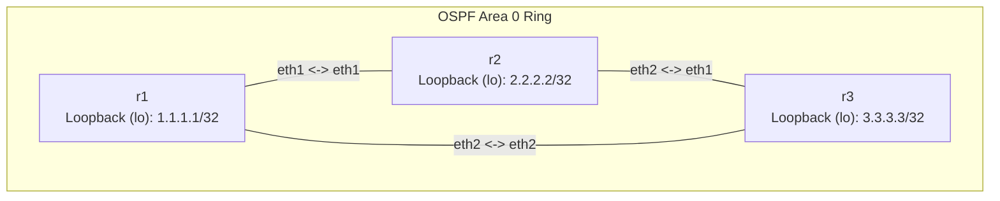

**Language / Ngôn ngữ:** [English](lab-guide_en.md) | [Tiếng Việt](lab-guide.md)

# Bài 16: Git Workflow Cho Network Config

**Arc 3 — Automation/NetDevOps**

## Mục tiêu
- Quản lý cấu hình router bằng Git: mỗi thay đổi config là 1 commit, có lịch sử và khả năng rollback.
- Thực hành quy trình branch → sửa config → test → merge → deploy — giống GitOps trong production.
- Viết script deploy config từ Git repo vào container FRR đang chạy.

## Yêu cầu tiên quyết
Hoàn thành [09-ospf-multi-area](../09-ospf-multi-area/lab-guide.md) — quen sửa `frr.conf` trên FRR.
Cài `git` trên server: `sudo apt install -y git` (hoặc đã có sẵn).

## Sơ đồ topology


Tất cả interface và OSPF đã cấu hình hoàn chỉnh trong `configs/`. Lab này **không cần sửa routing** — tập trung vào quy trình Git + deploy.

## Đề bài / Yêu cầu

1. Deploy topology, xác nhận OSPF đã hội tụ (`show ip ospf neighbor` trên mỗi router — 2 neighbor `Full`).
2. **Khởi tạo Git repo** cho config:
   ```bash
   cd configs
   git init
   git add .
   git commit -m "initial: OSPF ring r1-r2-r3"
   ```
3. **Tạo branch** cho thay đổi mới:
   ```bash
   git checkout -b feature/add-loopback
   ```
4. **Sửa config:** thêm loopback IP vào mỗi router (`interface lo` + `ip address x.x.x.x/32`) trong file `configs/<router>/frr.conf`:
   - `r1`: `1.1.1.1/32`
   - `r2`: `2.2.2.2/32`
   - `r3`: `3.3.3.3/32`
   Thêm `network <loopback>/32 area 0` vào `router ospf` để quảng bá loopback.
5. **Commit:**
   ```bash
   git add .
   git commit -m "feat: add loopback interfaces for r1, r2, r3"
   ```
6. **Deploy** bằng script [`script/deploy.sh`](./script/deploy.sh) (đang để `TODO` — tự hoàn thiện):
   - Script đọc list router, copy `frr.conf` mới vào container, reload FRR.
   - Chạy: `bash script/deploy.sh`
7. **Verify:** `show ip route ospf` trên mỗi router phải thấy 2 loopback còn lại (học qua OSPF). Ping `1.1.1.1` từ `r3` → thông.
8. **Merge** vào main:
   ```bash
   git checkout main
   git merge feature/add-loopback
   ```
9. **Rollback test:** xoá loopback `r3` khỏi config, commit, deploy — xác nhận route `3.3.3.3` biến mất khỏi routing table các router khác. Dùng `git diff HEAD~1` xem thay đổi, `git revert HEAD` để rollback nếu cần.
10. Ghi lại: nội dung `deploy.sh`, output `git log --oneline`, output `show ip route ospf` sau khi deploy.

## Gợi ý
- Script deploy dùng `docker cp` + `docker exec ... vtysh -c "copy running-config startup-config"` hoặc `docker exec ... /usr/lib/frr/frrinit.sh reload`.
- Nếu FRR không reload config mới sau `docker cp`, cần restart FRR trong container: `docker exec <router> /usr/lib/frr/frrinit.sh restart`.
- Tên container phụ thuộc vào `prefix` trong topology — bài này dùng `prefix: ""` nên tên container = tên node.

## Thảo luận và hỏi đáp
Bài tập này tự làm và tự xác minh kết quả. Nếu có thắc mắc hoặc cần trao đổi thêm, các bạn hãy đăng bài thảo luận trên group Facebook [Network Thực Chiến](https://www.facebook.com/profile.php?id=61591373979991).
## Bài tiếp theo
→ [17-nftables-firewall](../17-nftables-firewall/lab-guide.md): nftables firewall cơ bản.
