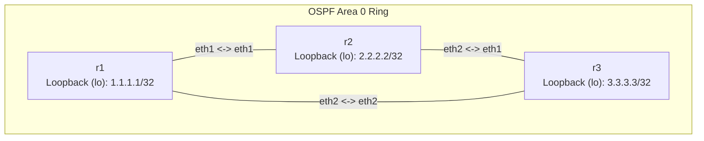

**Language / Ngôn ngữ:** [English](lab-guide_en.md) | [Tiếng Việt](lab-guide.md)

# Lab 16: Git Workflows for Network Configurations

**Arc 3 — Automation & NetDevOps**

## Objectives
- Manage network configurations with Git: tracking configuration modifications as distinct commits with complete revision history and rollback capabilities.
- Practice standard GitOps workflows (branching → modifying configs → testing → merging → deploying).
- Write a deployment script pushing updated configuration files from a Git repository to active FRR containers.

## Prerequisites
Completion of [09-ospf-multi-area](../09-ospf-multi-area/lab-guide_en.md) — familiarity with FRR `frr.conf` modifications.
Install Git on control node: `sudo apt install -y git`.

## Topology Diagram


All interfaces and baseline OSPF settings are pre-configured in `configs/`. This lab focuses on Git automation workflows rather than protocol troubleshooting.

## Tasks & Instructions

1. Deploy topology and verify baseline OSPF convergence (`show ip ospf neighbor` on each router — 2 neighbors in state `Full`).
2. **Initialize a Git repository** for configurations:
   ```bash
   cd configs
   git init
   git add .
   git commit -m "initial: OSPF ring r1-r2-r3"
   ```
3. **Create a feature branch**:
   ```bash
   git checkout -b feature/add-loopback
   ```
4. **Modify configuration files:** Add loopback interfaces (`interface lo` + `ip address x.x.x.x/32`) in `configs/<router>/frr.conf`:
   - `r1`: `1.1.1.1/32`
   - `r2`: `2.2.2.2/32`
   - `r3`: `3.3.3.3/32`
   Add `network <loopback>/32 area 0` under `router ospf` to advertise loopback subnets.
5. **Commit changes:**
   ```bash
   git add .
   git commit -m "feat: add loopback interfaces for r1, r2, r3"
   ```
6. **Deploy configurations** using [`script/deploy.sh`](./script/deploy.sh) (complete marked `TODO` sections):
   - Script reads target router list, copies updated `frr.conf` files into target containers, and reloads FRR daemons.
   - Execute: `bash script/deploy.sh`
7. **Verify deployment:** `show ip route ospf` on each router — verify remote loopbacks learned via OSPF. Ping `1.1.1.1` from `r3`.
8. **Merge into main branch:**
   ```bash
   git checkout main
   git merge feature/add-loopback
   ```
9. **Rollback Testing:** Remove `r3` loopback config, commit, deploy — confirm prefix `3.3.3.3` drops from remote routing tables. Use `git diff HEAD~1` and `git revert HEAD` to test automated rollbacks.
10. Record outputs: Completed `deploy.sh` + `git log --oneline` output + `show ip route ospf` outputs.

## Technical Hints
- Deployment scripts leverage `docker cp` + `docker exec <router> /usr/lib/frr/frrinit.sh reload` (or `restart`).

## Discussion & Community Support
This lab is self-guided. If you have questions or feedback, discuss them in the [Network Thực Chiến](https://www.facebook.com/profile.php?id=61591373979991) community.

## Next Lab
→ [17-nftables-firewall](../17-nftables-firewall/lab-guide_en.md): nftables Firewall Fundamentals.
