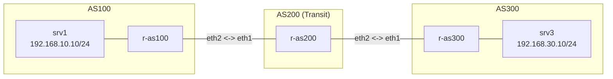

**Language / Ngôn ngữ:** [English](lab-guide_en.md) | [Tiếng Việt](lab-guide.md)

# Bài 19: Troubleshooting Chaos Lab — BGP

**Arc 5 — Troubleshooting chaos lab**

## Mục tiêu
- Rèn kỹ năng troubleshooting BGP có phương pháp: session lên Established nhưng route không quảng bá — tại sao?
- Không có gợi ý lỗi nằm ở đâu — tự tìm hoàn toàn, giống tình huống thực tế.

## Yêu cầu tiên quyết
Hoàn thành [10-bgp-ebgp-co-ban](../10-bgp-ebgp-co-ban/lab-guide.md) và [11-bgp-route-map-policy](../11-bgp-route-map-policy/lab-guide.md) — quen BGP session, route-map, prefix-list.

## Tình huống

Lab dưới đây **đã được cấu hình đầy đủ** — eBGP session giữa 3 AS (AS100, AS200, AS300), trông như đã hoàn chỉnh. Nhưng khi đồng nghiệp báo cáo:

> "srv1 không đến được srv3 — BGP session lên hết rồi, nhưng route không học được."

## Sơ đồ topology

Giống hệt Bài 10. Tất cả 3 router đã cấu hình `router bgp`, eBGP session **Established**. Nhưng route không đi qua r-as200 đến r-as300. Xem [`topology/chaos-bgp-lab.clab.yml`](./topology/chaos-bgp-lab.clab.yml).

## Đề bài / Yêu cầu

1. Deploy topology (`sudo clab deploy -t chaos-bgp-lab.clab.yml`).
2. Xác nhận: `srv1` **không** ping được `srv3`.
3. Kiểm tra eBGP session: `show ip bgp summary` trên cả 3 router — tất cả phải **Established**. Vậy lỗi không phải ở session.
4. Tìm nguyên nhân gốc. **Không có gợi ý vị trí lỗi.** Một vài hướng điều tra tổng quát:
   - Kiểm tra route nhận được: `show ip bgp` — router nào không thấy route đáng lẽ phải có?
   - Kiểm tra có route-map/prefix-list nào bị áp dụng: `show route-map`, `show ip prefix-list` — có rule nào lọc nhầm?
   - So sánh cấu hình 3 router — có điểm nào khác biệt bất thường?
5. Sửa lỗi bằng `vtysh` trên router liên quan.
6. Verify: `srv1` ping thông `srv3`, `show ip bgp` trên cả 3 router thấy đủ route.
7. Ghi lại: quá trình điều tra, nguyên nhân gốc, và cách sửa.

## Thảo luận và hỏi đáp
Bài tập này tự làm và tự xác minh kết quả. Nếu có thắc mắc hoặc cần trao đổi thêm, các bạn hãy đăng bài thảo luận trên group Facebook [Network Thực Chiến](https://www.facebook.com/profile.php?id=61591373979991).
## Bài tiếp theo
→ [20-wireguard-vpn-site-to-site](../20-wireguard-vpn-site-to-site/lab-guide.md): WireGuard VPN site-to-site.
