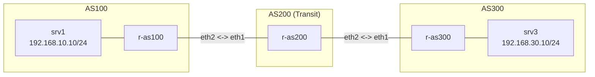

**Language / Ngôn ngữ:** [English](lab-guide_en.md) | [Tiếng Việt](lab-guide.md)

# Lab 19: Troubleshooting Chaos Lab — BGP

**Arc 5 — Troubleshooting Chaos Lab**

## Objectives
- Master systematic BGP troubleshooting methods: sessions reach `Established` state, yet prefixes are not exchanged — why?
- Diagnose complex BGP routing failures without hints, modeling real-world production escalation tickets.

## Prerequisites
Completion of [10-bgp-ebgp-co-ban](../10-bgp-ebgp-co-ban/lab-guide_en.md) and [11-bgp-route-map-policy](../11-bgp-route-map-policy/lab-guide_en.md) — eBGP sessions, route-maps, and prefix-lists.

## Outage Scenario

The lab environment is **pre-configured completely** — eBGP sessions across 3 ASes (AS100, AS200, AS300) are fully established. However, an escalation report states:

> "srv1 cannot reach srv3 — BGP sessions show Established across all routers, but prefixes are missing."

## Topology Diagram

See [`topology/chaos-bgp-lab.clab.yml`](./topology/chaos-bgp-lab.clab.yml). All 3 routers run `router bgp`, with eBGP neighbor status **Established**. However, prefixes fail to transit `r-as200` to reach `r-as300`.

## Tasks & Instructions

1. Deploy topology (`sudo clab deploy -t chaos-bgp-lab.clab.yml`).
2. Confirm outage: `srv1` **fails** to ping `srv3`.
3. Check eBGP sessions: `show ip bgp summary` on all 3 routers — all report **Established**. The issue is not session peering.
4. Investigate root cause. **No hints are provided.** Investigative pointers:
   - Inspect BGP table entries: `show ip bgp` — which router is missing target prefixes?
   - Check active route-maps and prefix-lists: `show route-map`, `show ip prefix-list` — are any filtering rules misconfigured?
   - Compare router configurations — identify parameters that deviate unexpectedly.
5. Resolve the fault live via `vtysh` on the affected router.
6. Verify: `srv1` successfully pings `srv3`, and `show ip bgp` across all 3 routers displays complete routing information.
7. Record your diagnostic process, identified root cause, and applied resolution.

## Discussion & Community Support
This lab is self-guided. If you have questions or feedback, discuss them in the [Network Thực Chiến](https://www.facebook.com/profile.php?id=61591373979991) community.

## Next Lab
→ [20-wireguard-vpn-site-to-site](../20-wireguard-vpn-site-to-site/lab-guide_en.md): WireGuard Site-to-Site VPN.
