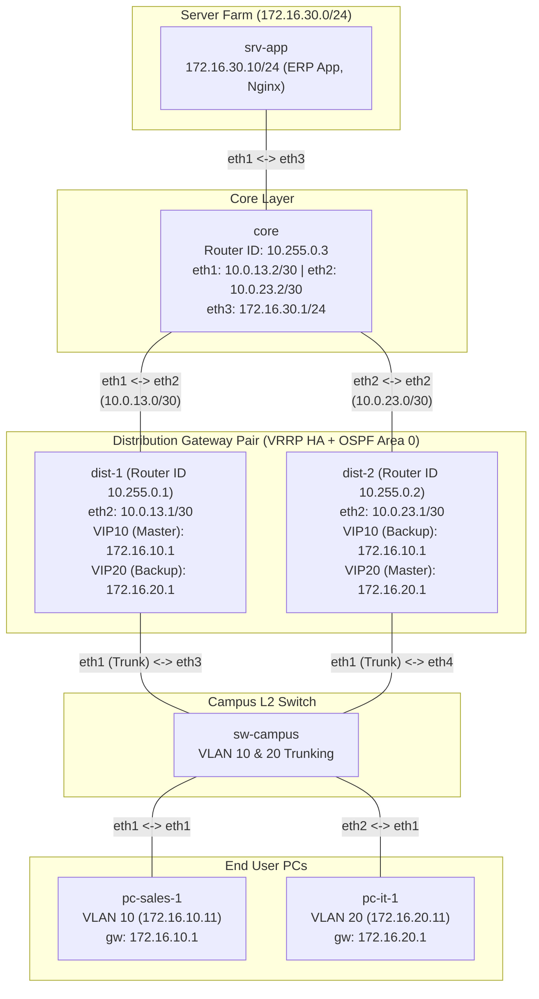

**Language / Ngôn ngữ:** [English](lab-guide_en.md) | [Tiếng Việt](lab-guide.md)

# Lab 22: OSPF Routing Core + Gateway HA (VRRP) for NTC Enterprise

**Arc 7 — Enterprise Network Deployment Project**

## Objectives
- Build an **OSPF routing core** using Area 0 (dist ↔ core, with passive-interfaces facing user/server LANs).
- Implement **VRRP active/active per-VLAN gateway redundancy** (load sharing: each dist acts as Master for one VLAN and Backup for the other).
- Upgrade gateway HA **without altering client configurations** — last week's `.1` gateway becomes the VRRP VIP.
- Measure actual failover time when a Master gateway fails.

## Prerequisites
- [21-enterprise-campus-lan](../21-enterprise-campus-lan/lab-guide_en.md) — Week 1 of the enterprise project.
- [09-ospf-multi-area](../09-ospf-multi-area/lab-guide_en.md) — OSPF configuration on FRR.
- [06-vrrp-ecmp-gateway-ha](../06-vrrp-ecmp-gateway-ha/lab-guide_en.md) — VRRP fundamentals.

## Enterprise Business Case
**Week 2 of the NTC Enterprise project.** Last week's campus LAN ran smoothly for 3 days until `dist-1` froze — plunging HQ into a 2-hour network outage, leading to the CTO getting called in by executive management. Requirements for this week:
1. **Eliminate Single Points of Failure (SPOF) at the gateway**: Add `dist-2` so that if one router fails, the other takes over in seconds **without requiring any end-user configuration changes** (PC gateway remains `.1`).
2. Utilize both gateway devices instead of leaving one idle: VLAN 10 traffic routes through `dist-1`, while VLAN 20 traffic routes through `dist-2` when both nodes are healthy.
3. Deploy an internal ERP application — build a **server farm** (`172.16.30.0/24`) behind the `core` router; route all internal traffic dynamically via **OSPF** (no more manually adding static routes).

> [!NOTE]
> Topology simplification: The campus LAN has been streamlined to a single `sw-campus` switch (pre-configured with VLANs identical to your Week 1 implementation) to conserve system memory for the new core layer. Technical concepts remain unchanged.

## Topology Diagram

See [`topology/routing-core-lab.clab.yml`](./topology/routing-core-lab.clab.yml).

Pre-configured elements:
- Campus LAN + PCs + `srv-app`: fully configured (from Week 1).
- `dist-1`, `dist-2`, `core`: IP interface addresses pre-assigned in `frr.conf`; `vrrp4-10`/`vrrp4-20` macvlan interfaces + VIPs pre-created (required by FRR `vrrpd`).
- **Your Tasks**: Complete the `TODO` sections in `configs/*/frr.conf` — OSPF across all 3 routers and VRRP on both distribution gateways.

## Tasks & Instructions

1. Configure **OSPF Area 0** on `dist-1`, `dist-2`, and `core` per `TODO` comments in `frr.conf`:
   - Router IDs: `10.255.0.1` / `.2` / `.3`.
   - Advertise all point-to-point subnets, VLAN subnets, and the server farm subnet.
   - Enable passive interfaces (`ip ospf passive` under interface configuration) on all user-facing and server-facing interfaces. Explain in your submission why this is mandatory in production networks.
2. Configure **VRRP** on both distribution routers: VRID 10 (VIP `172.16.10.1`) and VRID 20 (VIP `172.16.20.1`) with asymmetric priorities — `dist-1` as Master for VLAN 10, `dist-2` as Master for VLAN 20.
3. Control Plane Verification:
   - `show ip ospf neighbor` on `core` — verify two neighbors in `Full` state.
   - `show ip route ospf` on `dist-1` — verify route to `172.16.30.0/24`.
   - `show vrrp` on both dist routers — confirm VRID 10/20 Master/Backup roles match the design.
4. Data Plane Verification:
   - `pc-sales-1` → `srv-app`: `curl -s -o /dev/null -w "%{http_code}\n" http://172.16.30.10` returns `200`; `traceroute` traverses `172.16.10.1` then reaches `core`.
   - `pc-it-1` → `srv-app`: `traceroute` traverses `172.16.20.1` — confirming VLAN 20 actively utilizes `dist-2` (load sharing).
5. **Failover Testing** (CTO Requirement 1): From `pc-sales-1`, run a continuous ping to `172.16.30.10`; on `dist-1`, bring down the LAN interface (`ip link set eth1 down`) to simulate a link failure. Count packet loss, verify `show vrrp` on `dist-2` shows it transitioned to Master for both VRIDs, and confirm `traceroute` now routes via `dist-2`. Re-enable the interface and observe preemption.
6. Record your outputs: `show` command outputs, pre/post-failover `traceroute` results, and packet loss counts during failover.

## Technical Hints
- FRR VRRP blocks are configured **under sub-interfaces `eth1.10` / `eth1.20`** (`vrrp 10`, `vrrp 10 ip ...`, `vrrp 10 priority ...`). Modify settings via `vtysh` or edit config files and load using `docker exec <node> vtysh -f /etc/frr/frr.conf`. **Do NOT use `docker restart`** — restarting causes containers to lose network interfaces created by Containerlab. If restarted accidentally, destroy and re-deploy the lab topology.
- If `show vrrp` returns empty output, check `vrrpd=yes` in `/etc/frr/daemons` and verify `vrrp4-10`/`vrrp4-20` macvlan interfaces exist (`ip -d link show`).
- If OSPF neighbors fail to form, double-check network statements against `/30` subnets and verify interfaces are not inadvertently set to passive.

## Bonus Challenges
- Adjust **OSPF metrics/costs** on uplink interfaces so return traffic from the server farm to VLAN 10 prefers the `dist-1 → core` path when both links are operational; verify using `show ip route` and `traceroute`.
- Explain in your lab report: Why does this topology only require a single **Area 0**, whereas Lab 09 required multi-area OSPF? At what network scale should multi-area design be introduced?

## Discussion & Community Support
This lab is self-guided. If you have questions or feedback, discuss them in the [Network Thực Chiến](https://www.facebook.com/profile.php?id=61591373979991) community.

## Next Lab
→ [23-enterprise-wan-branch](./lab-guide_en.md): Enterprise WAN & Branch Connection (eBGP).
