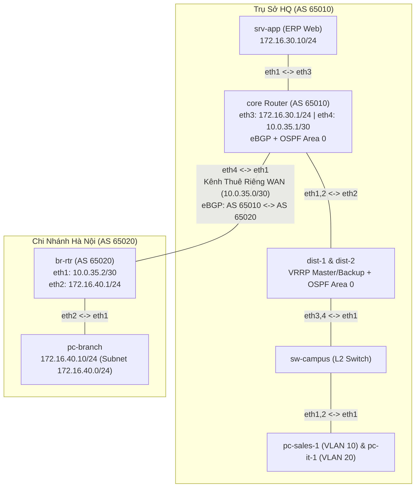

# Bài 23: Kết nối chi nhánh Hà Nội qua WAN (eBGP)

**Arc 7 — Triển khai mạng doanh nghiệp (dự án xuyên suốt)**

## Mục tiêu
- Đấu nối 2 site doanh nghiệp qua kênh thuê riêng, chạy **eBGP với private AS**.
- Hiểu ranh giới **IGP (OSPF trong site) vs EGP (BGP giữa site)** — mô hình chuẩn multi-site.
- Redistribute BGP → OSPF để toàn HQ tự học đường tới chi nhánh.
- Kiểm chứng dịch vụ end-to-end: chi nhánh dùng được ERP đặt tại HQ.

## Yêu cầu tiên quyết
- [22-enterprise-routing-core-ha](../22-enterprise-routing-core-ha/lab-guide.md) — tuần 2 của dự án.
- [10-bgp-ebgp-co-ban](../10-bgp-ebgp-co-ban/lab-guide.md) — eBGP trên FRR.

## Bối cảnh công ty
**Tuần 3 của dự án NTC.** Công ty khai trương **chi nhánh Hà Nội** (~10 người). Đã ký hợp đồng kênh truyền riêng (leased line) HQ ↔ chi nhánh. Yêu cầu của CTO:
1. Nhân viên chi nhánh phải dùng được **ERP** (`srv-app` tại HQ) như ngồi ở trụ sở.
2. Định tuyến giữa 2 site chạy **BGP** với private AS (HQ = **AS 65010**, chi nhánh = **AS 65020**) — chuẩn bị sẵn cho tương lai thêm chi nhánh/nhà cung cấp khác, và để ranh giới quản trị 2 site độc lập (đội HQ không đụng config IGP của chi nhánh).
3. Mọi router trong HQ phải **tự học** đường tới chi nhánh — cấm gõ static route thủ công trên dist.
4. Địa chỉ chi nhánh đã duyệt: `172.16.40.0/24`, WAN link `10.0.35.0/30`.

## Sơ đồ topology

Chi tiết xem [`topology/wan-branch-lab.clab.yml`](./topology/wan-branch-lab.clab.yml).

Đã chuẩn bị sẵn:
- Toàn bộ HQ tuần 1–2 (VLAN, OSPF, VRRP) chạy hoàn chỉnh — xem `configs/dist-*/frr.conf` như tài liệu as-built.
- `br-rtr`, `pc-branch`: IP interface đã gán.
- **Việc của bạn**: TODO trong `configs/core/frr.conf` và `configs/br-rtr/frr.conf`.

## Đề bài / Yêu cầu

1. Cấu hình **eBGP** giữa `core` (AS 65010) và `br-rtr` (AS 65020) theo TODO:
   - HQ quảng bá `172.16.10.0/24`, `172.16.20.0/24`, `172.16.30.0/24`.
   - Chi nhánh quảng bá `172.16.40.0/24`.
   - Dùng `network` statement, **không** `redistribute connected` (đọc lý do trong TODO).
2. Làm HQ tự học đường chi nhánh (yêu cầu 3): `redistribute bgp` vào OSPF trên `core`.
3. Verify control plane:
   - `show bgp summary` trên cả 2 đầu — session Established, đúng số prefix nhận.
   - `show ip route bgp` trên `core` — thấy `172.16.40.0/24`.
   - `show ip route` trên `dist-1` — thấy `172.16.40.0/24` loại **O E2** (external, học từ redistribute).
   - `show ip route bgp` trên `br-rtr` — đủ 3 prefix HQ.
4. Verify dịch vụ end-to-end (yêu cầu 1):
   - `pc-branch` chạy `curl -s -o /dev/null -w "%{http_code}\n" http://172.16.30.10` → `200`.
   - `traceroute` từ `pc-branch` tới `srv-app` và từ `pc-sales-1` tới `pc-branch` — chỉ ra từng hop đi qua đâu, chiều về có đối xứng không.
5. Ghi lại: output show + curl + traceroute 2 chiều.

## Gợi ý
- BGP session Established nhưng `PfxRcd = 0` → thiếu `no bgp ebgp-requires-policy` (một trong 2 đầu).
- `network` statement chỉ quảng bá prefix **đang có trong bảng route** — trên `core`, mạng VLAN 10/20 phải học được qua OSPF trước đã (kiểm tra `show ip route ospf`).
- `dist-1` không thấy route chi nhánh → quên `redistribute bgp` trong `router ospf` của `core`.
- `pc-branch` ping `srv-app` được nhưng ping `172.16.10.11` không được → kiểm tra HQ đã quảng bá đủ 3 prefix chưa.

## Bonus
- **Đứt cáp WAN**: `ip link set eth4 down` trên `core` (hoặc eth1 trên br-rtr), quan sát BGP session rớt sau hold-time (mặc định 180s — thử `timers bgp 3 9` xem hội tụ nhanh hơn); route E2 trên dist biến mất theo.
- **Lọc đầu vào** (chuẩn production): trên `core`, thêm prefix-list chỉ nhận đúng `172.16.40.0/24` từ chi nhánh — thử cho `br-rtr` quảng bá thêm 1 prefix "lạ" (vd `192.168.99.0/24` từ interface loopback) và xác nhận HQ không nhận.

## Thảo luận và hỏi đáp
Bài tập này tự làm và tự xác minh kết quả. Nếu có thắc mắc hoặc cần trao đổi thêm, các bạn hãy đăng bài thảo luận trên group Facebook [Network Thực Chiến](https://www.facebook.com/profile.php?id=61591373979991).
## Bài tiếp theo
→ Bài 24 — Tuần 4 (finale): đấu nối **internet** — NAT, firewall nftables phân vùng, chi nhánh ra internet tập trung qua HQ. (sắp ra mắt)
