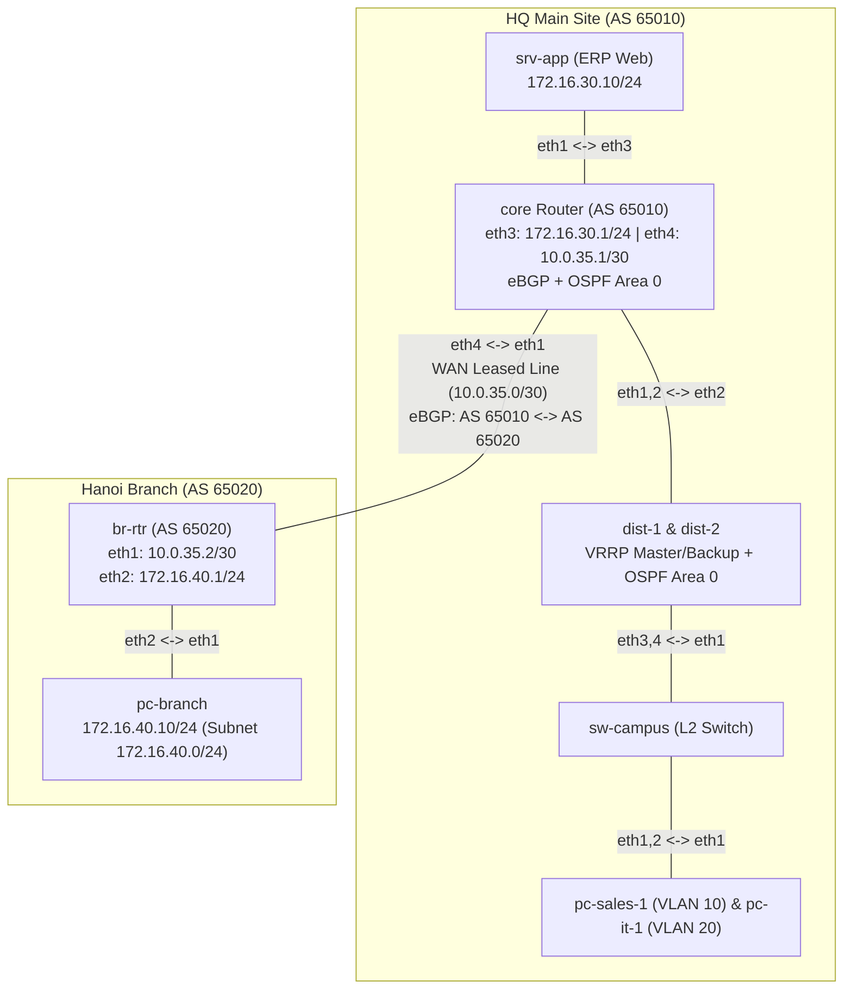

**Language / Ngôn ngữ:** [English](lab-guide_en.md) | [Tiếng Việt](lab-guide.md)

# Lab 23: Connecting Hanoi Branch via Enterprise WAN (eBGP)

**Arc 7 — Enterprise Network Deployment Project**

## Objectives
- Connect two enterprise sites over a leased line running **eBGP with private Autonomous System Numbers (ASNs)**.
- Understand the boundary between **IGP (OSPF inside sites) vs. EGP (BGP between sites)** — standard multi-site enterprise architecture.
- Redistribute BGP → OSPF so all HQ routers dynamically learn routes to the branch network.
- Verify end-to-end service connectivity: ensure branch users can access the ERP system located at HQ.

## Prerequisites
- [22-enterprise-routing-core-ha](../22-enterprise-routing-core-ha/lab-guide_en.md) — Week 2 of the enterprise project.
- [10-bgp-ebgp-co-ban](../10-bgp-ebgp-co-ban/lab-guide_en.md) — eBGP fundamentals on FRR.

## Enterprise Business Case
**Week 3 of the NTC Enterprise project.** The company opens its new **Hanoi Branch** (~10 users). A dedicated point-to-point WAN leased line between HQ and the branch has been provisioned. Requirements from the CTO:
1. Branch staff must access the internal **ERP application** (`srv-app` at HQ) seamlessly, as if they were sitting in HQ.
2. Inter-site routing must use **BGP** with private ASNs (HQ = **AS 65010**, Branch = **AS 65020**) — preparing for future site additions/third-party providers and keeping administrative boundaries separate.
3. Every router inside HQ must **dynamically learn** branch routes — manually configuring static routes on distribution routers is strictly prohibited.
4. Approved branch addressing: `172.16.40.0/24`, WAN transit link `10.0.35.0/30`.

## Topology Diagram

See [`topology/wan-branch-lab.clab.yml`](./topology/wan-branch-lab.clab.yml).

Pre-configured elements:
- Entire HQ infrastructure from Weeks 1–2 (VLANs, OSPF, VRRP) is pre-configured — inspect `configs/dist-*/frr.conf` as as-built documentation.
- `br-rtr`, `pc-branch`: IP interfaces pre-assigned.
- **Your Tasks**: Complete `TODO` sections in `configs/core/frr.conf` and `configs/br-rtr/frr.conf`.

## Tasks & Instructions

1. Configure **eBGP** between `core` (AS 65010) and `br-rtr` (AS 65020) according to `TODO` items:
   - HQ advertises `172.16.10.0/24`, `172.16.20.0/24`, `172.16.30.0/24`.
   - Hanoi Branch advertises `172.16.40.0/24`.
   - Use explicit `network` statements; do **NOT** use `redistribute connected` (read comments in `TODO`).
2. Enable dynamic propagation into HQ: `redistribute bgp` into OSPF on `core`.
3. Control Plane Verification:
   - `show bgp summary` on both routers — confirm session state is `Established` and prefix counts match expectations.
   - `show ip route bgp` on `core` — verify presence of `172.16.40.0/24`.
   - `show ip route` on `dist-1` — verify `172.16.40.0/24` learned as **O E2** (external route redistributed from BGP).
   - `show ip route bgp` on `br-rtr` — verify all 3 HQ prefixes are received.
4. End-to-End Service Verification:
   - From `pc-branch`, run `curl -s -o /dev/null -w "%{http_code}\n" http://172.16.30.10` → expect HTTP `200`.
   - Run `traceroute` from `pc-branch` to `srv-app` and from `pc-sales-1` to `pc-branch` — identify all intermediate hops and check for path symmetry.
5. Record your outputs: BGP summary outputs, HTTP curl responses, and bidirectional traceroute logs.

## Technical Hints
- If the BGP session is `Established` but `PfxRcd = 0`, check for missing `no bgp ebgp-requires-policy` on either peer.
- The `network` statement only advertises prefixes **currently present in the IP routing table** — on `core`, VLAN 10/20 subnets must first be learned via OSPF (verify with `show ip route ospf`).
- If `dist-1` lacks the branch route, verify `redistribute bgp` is configured under `router ospf` on `core`.

## Bonus Challenges
- **Simulate WAN Link Outage**: Shut down `eth4` on `core` (`ip link set eth4 down`), observe BGP session drop after hold timer expiration (default 180s — try tuning `timers bgp 3 9` for faster convergence); observe OSPF E2 routes being withdrawn from distribution routers.
- **Inbound Filtering**: On `core`, implement a BGP prefix-list permitting strictly `172.16.40.0/24` from the branch — test advertising an unauthorized prefix (e.g., `192.168.99.0/24` loopback on `br-rtr`) and verify HQ rejects it.

## Discussion & Community Support
This lab is self-guided. If you have questions or feedback, discuss them in the [Network Thực Chiến](https://www.facebook.com/profile.php?id=61591373979991) community.

## Next Lab
→ [24-enterprise-internet-edge](./lab-guide_en.md): Enterprise Internet Edge & Zoning Firewall (NAT + nftables).
