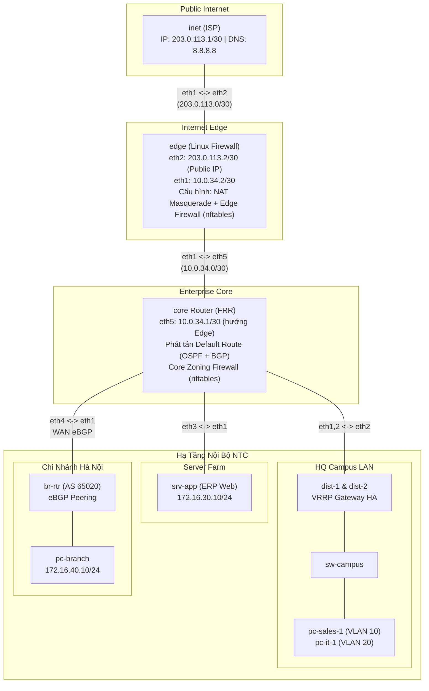

**Language / Ngôn ngữ:** [English](lab-guide_en.md) | [Tiếng Việt](lab-guide.md)

# Bài 24: Internet edge — NAT + firewall nftables cho toàn NTC

**Arc 7 — Triển khai mạng doanh nghiệp (dự án xuyên suốt)**

## Mục tiêu
- Đấu nối internet cho toàn công ty: **NAT masquerade** tại biên, default route phát tán tập trung (OSPF `default-information originate` + BGP `default-originate`).
- **Firewall phân vùng (zoning)** bằng nftables, chính sách default-drop, đặt đúng chỗ: biên (edge) lọc internet, lõi (core) phân vùng nội bộ.
- Mô hình **centralized internet breakout**: chi nhánh ra internet qua HQ.
- Hoàn thiện dự án 4 tuần — topology cuối = 1 mạng doanh nghiệp đầy đủ.

## Yêu cầu tiên quyết
- [23-enterprise-wan-branch](../23-enterprise-wan-branch/lab-guide.md) — tuần 3 của dự án.
- [08-nat-masquerade-linux](../08-nat-masquerade-linux/lab-guide.md) — NAT/masquerade.
- [17-nftables-firewall](../17-nftables-firewall/lab-guide.md) — nftables cơ bản.

## Bối cảnh công ty
**Tuần 4 — tuần cuối dự án NTC.** Đường FTTH doanh nghiệp đã kéo về trụ sở (IP tĩnh `203.0.113.2`). Yêu cầu nghiệm thu của CTO:
1. Toàn bộ nhân viên (cả trụ sở **và chi nhánh**) ra được internet. Chi nhánh **không** thuê đường internet riêng — mọi traffic đổ về HQ rồi mới ra ngoài (một cửa kiểm soát duy nhất).
2. Kẻ ngoài internet **không** được tự mở kết nối vào mạng trong.
3. Phân vùng nội bộ: phòng nào cũng dùng được **ERP** (web, port 80); riêng **SSH vào server farm chỉ dành cho phòng Kỹ thuật**; chi nhánh tin cậy — truy cập được server farm.
4. Cấm gõ static route thủ công trên dist/br-rtr — default route phải được **phát tán bằng giao thức định tuyến** từ core.

## Sơ đồ topology

Chi tiết xem [`topology/internet-edge-lab.clab.yml`](./topology/internet-edge-lab.clab.yml).

Đã chuẩn bị sẵn:
- Toàn bộ lớp tuần 1–3 chạy hoàn chỉnh ngay khi deploy.
- `edge`: IP + `ip_forward` + route (summary `172.16.0.0/16` vào trong, default ra `inet`) — đọc comment trong topology về vì sao biên chỉ cần 2 route tĩnh.
- 2 file skeleton bind sẵn vào container: [`nftables/edge-rules.nft`](./nftables/edge-rules.nft) và [`nftables/core-rules.nft`](./nftables/core-rules.nft).
- **Việc của bạn**: TODO trong `configs/core/frr.conf` + 2 file `.nft`.

## Đề bài / Yêu cầu

1. **Phát tán default route** (yêu cầu 4) theo TODO trong `configs/core/frr.conf`. Verify:
   - `dist-1`: `show ip route` có `O*E2 0.0.0.0/0`.
   - `br-rtr`: `show ip route` có `B> 0.0.0.0/0`.
2. **NAT + firewall biên**: hoàn thành `edge-rules.nft`, nạp bằng `nft -f`. Verify:
   - `pc-sales-1` và `pc-branch`: `ping -c3 8.8.8.8` thông; `curl -s -o /dev/null -w "%{http_code}\n" http://203.0.113.1` trả `200`.
   - Trên `inet`: `tcpdump -n -i eth1` trong lúc PC curl — source phải là `203.0.113.2` (đã NAT), tuyệt đối không thấy IP `172.16.x.x`.
   - Negative test (yêu cầu 2): từ `inet` thử `curl --connect-timeout 3 http://203.0.113.2:80` và ping `172.16.30.10` — phải **thất bại**.
3. **Phân vùng nội bộ** (yêu cầu 3): hoàn thành `core-rules.nft`, nạp trên `core`. Verify từng dòng chính sách, mỗi dòng 1 positive + 1 negative test:
   - `pc-sales-1` → `curl http://172.16.30.10` → `200`; `pc-sales-1` → SSH `172.16.30.10` → **timeout**.
   - `pc-it-1` → SSH `172.16.30.10` (`nc -zv -w3 172.16.30.10 22`) → **connect được**.
   - `pc-branch` → `curl http://172.16.30.10` → `200`.
   - Dùng `nft list ruleset` — chỉ ra **counter** của rule nào tăng sau mỗi test.
4. **Chứng minh centralized breakout** (yêu cầu 1): `traceroute -n 8.8.8.8` từ `pc-branch` — đường đi phải là `br-rtr → core → edge`, không có lối tắt.
5. Ghi lại: output verify từng mục + bảng tóm tắt "chính sách ↔ rule ↔ kết quả test".

## Gợi ý
- Nạp ruleset: `docker exec edge nft -f /etc/nftables/edge-rules.nft` (file bind sẵn — sửa trên máy host là container thấy ngay).
- Ping 8.8.8.8 không thông: chia đôi vấn đề — `traceroute` xem chết ở hop nào. Chết trước `edge` = thiếu default route (mục 1); tới `edge` rồi tắc = thiếu NAT/rule forward (mục 2). Kiểm tra counter để biết packet có khớp rule không.
- Forward chain trên `core` chỉ lọc traffic **xuyên qua** core — traffic giữa VLAN 10 và 20 quay đầu ngay tại dist, không bị chặn (thử lý giải trong bài nộp).
- `nc -zv -w3 <ip> 22` test SSH nhanh, không cần password.
- Sai thứ tự rule là sai policy: nftables duyệt từ trên xuống, rule accept rộng đặt trên rule hẹp sẽ "nuốt" mất.

## Bonus
1. **Publish ERP ra internet (DNAT)**: hoàn thành TODO 3 trong `edge-rules.nft` — từ `inet` chạy `curl http://203.0.113.2:8080` phải nhận trang ERP (nginx của srv-app), kèm rule forward tương ứng. Sau đó giải thích: mở dịch vụ kiểu này khác gì mô hình DMZ chuẩn, rủi ro gì?
2. **DHCP cho VLAN 10**: cài dnsmasq trên `dist-1` (tham chiếu bài [07](../07-dhcp-server-relay/lab-guide.md)) cấp IP dải `172.16.10.100-200`, gateway trỏ VIP `.1` — PC mới cắm vào là chạy, đúng trải nghiệm văn phòng thật.

## Thảo luận và hỏi đáp
Bài tập này tự làm và tự xác minh kết quả. Nếu có thắc mắc hoặc cần trao đổi thêm, các bạn hãy đăng bài thảo luận trên group Facebook [Network Thực Chiến](https://www.facebook.com/profile.php?id=61591373979991).
## Bài tiếp theo
🎉 **Kết thúc Arc 7** — bạn vừa triển khai trọn vẹn 1 mạng doanh nghiệp: campus VLAN → OSPF core + VRRP HA → eBGP WAN → internet edge có NAT/firewall. Tổng kết dự án: vẽ lại sơ đồ cuối cùng, liệt kê những quyết định thiết kế bạn sẽ làm khác nếu triển khai thật (và vì sao). Tiếp theo có thể quay lại Arc 3 (tự động hóa chính mạng này bằng Ansible) hoặc Arc 5 (chaos lab troubleshooting).
