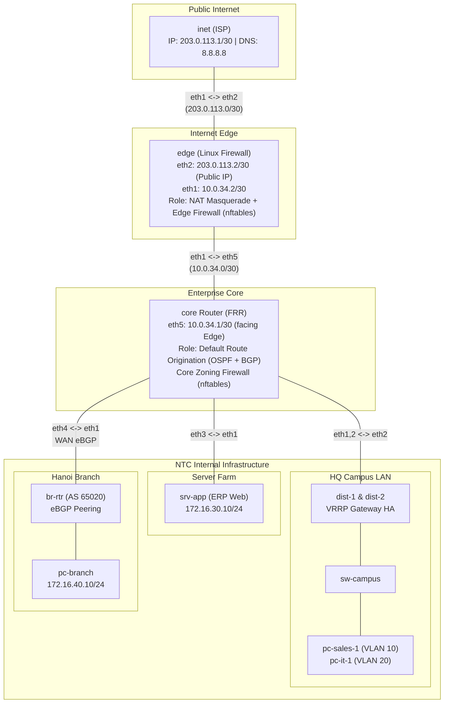

**Language / Ngôn ngữ:** [English](lab-guide_en.md) | [Tiếng Việt](lab-guide.md)

# Lab 24: Enterprise Internet Edge — NAT & nftables Zoning Firewall

**Arc 7 — Enterprise Network Deployment Project**

## Objectives
- Implement internet connectivity for the enterprise: **NAT masquerade** at the edge, centralized default route origination (OSPF `default-information originate` + BGP `default-originate`).
- Build a **zoning firewall** using Linux `nftables` with a default-drop policy: place rules appropriately (edge node filters internet traffic; core router enforces internal zoning policies).
- Deploy a **centralized internet breakout model**: branch office internet traffic breaks out through HQ.
- Finalize the 4-week project — completing a full end-to-end enterprise network topology.

## Prerequisites
- [23-enterprise-wan-branch](../23-enterprise-wan-branch/lab-guide_en.md) — Week 3 of the enterprise project.
- [08-nat-masquerade-linux](../08-nat-masquerade-linux/lab-guide_en.md) — NAT & masquerade.
- [17-nftables-firewall](../17-nftables-firewall/lab-guide_en.md) — nftables firewall basics.

## Enterprise Business Case
**Week 4 — Final week of the NTC Enterprise project.** Enterprise FTTH internet service has been delivered to HQ (Static IP `203.0.113.2`). Acceptance requirements from the CTO:
1. All enterprise staff (both HQ **and branch offices**) must have outbound internet access. The branch office does **not** maintain an independent internet connection — all branch traffic must route through HQ for centralized security enforcement.
2. Unsolicited inbound connections from the internet to internal subnets must be strictly **blocked**.
3. Internal Zoning Policies: All departments are permitted to access the **ERP application** (HTTP port 80); **SSH access to the server farm is restricted exclusively to the IT department**; the trusted branch office is permitted to access the server farm.
4. Manually adding static default routes on distribution or branch routers is forbidden — default routes must be **dynamically originated and propagated** via routing protocols from `core`.

## Topology Diagram

See [`topology/internet-edge-lab.clab.yml`](./topology/internet-edge-lab.clab.yml).

Pre-configured elements:
- Complete infrastructure from Weeks 1–3 runs upon deployment.
- `edge`: IP addresses + `ip_forward` + static routes (summary `172.16.0.0/16` inward, default route outward to `inet`).
- Skeleton rule files pre-mounted: [`nftables/edge-rules.nft`](./nftables/edge-rules.nft) and [`nftables/core-rules.nft`](./nftables/core-rules.nft).
- **Your Tasks**: Complete `TODO` items in `configs/core/frr.conf` and both `.nft` firewall policy files.

## Tasks & Instructions

1. **Originate and Propagate Default Routes** (CTO Requirement 4) per `TODO` in `configs/core/frr.conf`. Verification:
   - `dist-1`: `show ip route` contains `O*E2 0.0.0.0/0`.
   - `br-rtr`: `show ip route` contains `B> 0.0.0.0/0`.
2. **Edge NAT & Firewalling**: Complete `edge-rules.nft` and load with `nft -f`. Verification:
   - From `pc-sales-1` and `pc-branch`: `ping -c3 8.8.8.8` succeeds; `curl -s -o /dev/null -w "%{http_code}\n" http://203.0.113.1` returns `200`.
   - On `inet`: Run `tcpdump -n -i eth1` while PCs execute `curl` — verify source IP is translated to `203.0.113.2` (NATed), ensuring no internal `172.16.x.x` addresses leak onto the internet.
   - Negative Testing (CTO Requirement 2): From `inet`, attempt `curl --connect-timeout 3 http://203.0.113.2:80` and `ping 172.16.30.10` — confirm connections fail.
3. **Internal Core Zoning Firewall** (CTO Requirement 3): Complete `core-rules.nft` and apply on `core`. Verify each security policy statement with positive and negative test cases:
   - `pc-sales-1` → `curl http://172.16.30.10` → HTTP `200`; `pc-sales-1` → SSH `172.16.30.10` → **timeout / blocked**.
   - `pc-it-1` → SSH `172.16.30.10` (`nc -zv -w3 172.16.30.10 22`) → **connection successful**.
   - `pc-branch` → `curl http://172.16.30.10` → HTTP `200`.
   - Run `nft list ruleset` — identify rule **counter** increments after each test execution.
4. **Demonstrate Centralized Internet Breakout** (CTO Requirement 1): Run `traceroute -n 8.8.8.8` from `pc-branch` — confirm the packet forwarding path is `br-rtr → core → edge → inet`.
5. Record your results: Verification command outputs and a policy summary matrix (`Security Requirement ↔ nftables Rule ↔ Test Verdict`).

## Technical Hints
- Load ruleset: `docker exec edge nft -f /etc/nftables/edge-rules.nft`.
- If `ping 8.8.8.8` fails, isolate the issue: use `traceroute` to identify where packets drop. Drops before `edge` indicate missing default routes; drops at `edge` indicate missing NAT or forwarding rules.

## Bonus Challenges
1. **Expose ERP to the Internet (DNAT)**: Complete TODO 3 in `edge-rules.nft` — from `inet`, run `curl http://203.0.113.2:8080` to reach the internal ERP web server. Explain: How does this differ from a true DMZ model, and what security risks does it introduce?
2. **DHCP Services for VLAN 10**: Install `dnsmasq` on `dist-1` (refer to Lab [07](../07-dhcp-server-relay/lab-guide_en.md)) to dynamically assign IP addresses in the `172.16.10.100-200` range with gateway `.1`.

## Discussion & Community Support
This lab is self-guided. If you have questions or feedback, discuss them in the [Network Thực Chiến](https://www.facebook.com/profile.php?id=61591373979991) community.

## Arc 7 Conclusion
🎉 **Arc 7 Completed** — You have successfully built a full multi-site enterprise network infrastructure: Campus VLANs → OSPF Core + VRRP HA → eBGP WAN → Internet Edge with NAT & Zoning Firewalls!
